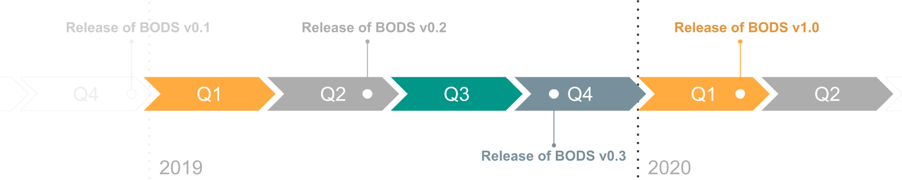

About
=====

This website contains the draft specification of the Beneficial Ownership Data Standard (version 0.2) plus support for its use. The Standard provides a structured template for describing beneficial ownership as machine-readable data.

.. cssclass:: h2

        Background

Money laundering, tax evasion and obscure chains of ownership are transnational problems that require a transnational solution. Civil society, government and business can all benefit from greater transparency around :ref:`beneficial ownership <what-is-bo>`.

The Beneficial Ownership Data Standard enables this transparency by providing a solid conceptual and practical framework for collecting and publishing beneficial ownership data, resulting in data that is interoperable, more easily reused, and of higher quality.

The Standard is being developed under the guidance of a :doc:`working group <governance>` co-chaired by OpenOwnership. More details about the organisation are available at www.openownership.org.

.. cssclass:: h2

        Current status of the standard

This is v0.2 of the Beneficial Ownership Data Standard. The data model
has been updated and additional codelist information added since v0.1.

Implementers should be aware that future changes are anticipated, before
a version 1.0 release. However, from the v0.1 release onwards, any
structural changes or major definitional changes only take place
following consultation. A clear :ref:`changelog <changelog>` is provided,
and the documentation of previous versions is maintained in archive
form.

The schema contains a structure, fields and codelists but does not yet
enforce validation constraints on most fields.

.. cssclass:: h2

        Get involved

All changes to the standard draft, documentation and specification take
place via GitHub at https://github.com/openownership/data-standard/.

Suggestions for changes can be made via the `project issue
tracker <https://github.com/openownership/data-standard/issues>`__.

If you would like to be involved in the development and review of the
Standard, see the :doc:`Governance <governance>` page.

.. toctree::
    :hidden:
    :maxdepth: 1

    governance
    credits
    support
    privacy-notice
       
.. cssclass:: h2

        Partners and funders

The initial development of the Beneficial Ownership Data Standard was
funded by OpenOwnership as part of a UK Department for International
Development funded project. OpenOwnership is led by a steering group of
the world's leading transparency organizations including `Transparency
International <https://www.transparency.org/>`__,
`OpenCorporates <https://opencorporates.com>`__,
`One <https://www.one.org/international/>`__, the `Open Contracting
Partnership <http://www.open-contracting.org>`__, `Global
Witness <https://www.globalwitness.org/en-gb/>`__ and `The B
Team <http://bteam.org/>`__.

The specification and documentation have been developed by `Open Data
Services Co-operative <http://www.opendataservices.coop>`__ and
`OpenCorporates <https://opencorporates.com>`__. Read the
:doc:`credits <credits>` for full details of the Standard's developers.

.. cssclass:: h2

        License and contributor agreement

Schema contents of the Beneficial Ownership Data Standard are 
Copyright (C) 2016-2020 OpenOwnership.

The schema is licensed under the Apache License, Version 2.0.

Contributors are required to accept the `contributor
agreement <https://github.com/openownership/data-standard/blob/master/CONTRIBUTING.md>`__.

.. cssclass:: h2

        Contact

For more details about OpenOwnership, please email
support@openownership.org.
