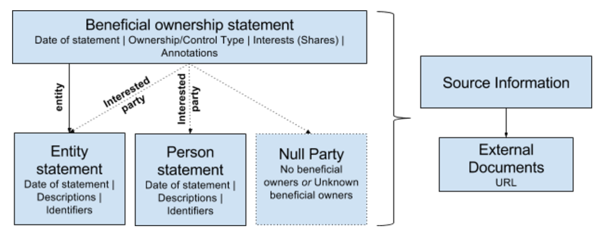

Modelling beneficial ownership information
==========================================

The conceptual model for the Standard was developed in late 2016/early 2017 and [is documented here](https://github.com/openownership/data-standard/issues/7).

We model information on beneficial ownership in terms of a collection of statements. Each statement represents the assertions made by a particular agent at a particular point in time.

It is up to data consumers to decide which statements to trust, and to reconcile the identity of the entities and persons described in those statements based on the identifying information contained within each statement. 



This abstraction is important to represent the reality of how data is provided, to support integration of data from different systems and [bi-temporal modelling](https://en.wikipedia.org/wiki/Bitemporal_Modeling), and to recognise that any dataset may contain overlapping or conflicting claims about ownership and control that need to be resolved in application specific ways. 

## Immutability of statements

Statements are considered immutable. If a field is updated, this should be considered to create a new statement, with a new identifier. 

## Updating statements

Where a ```statementGroup``` or ```statement``` replaces a previous statement this should be explicitly declared using a ```replacesStatementGroup``` or ```replacesStatement``` property. 
