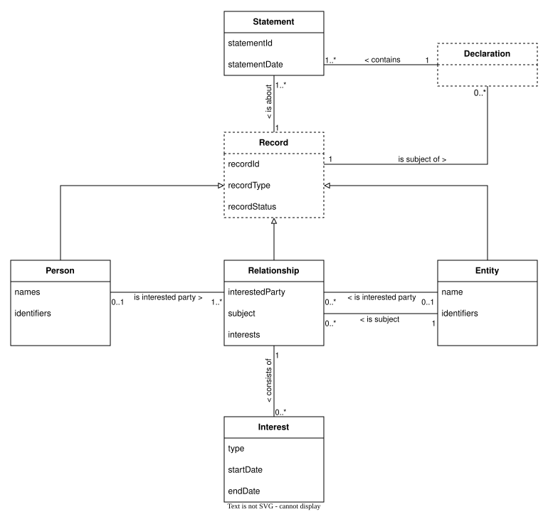
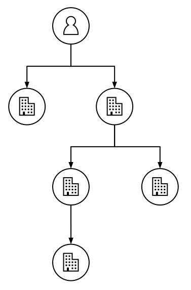
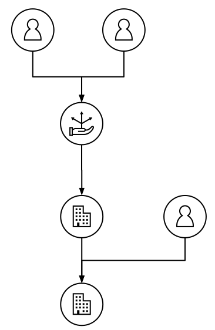
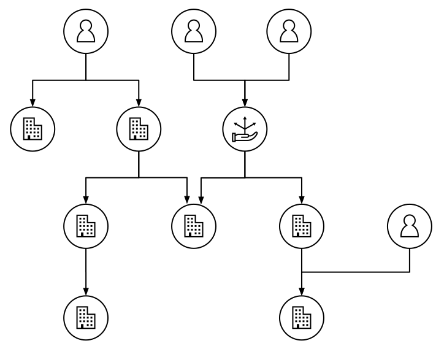
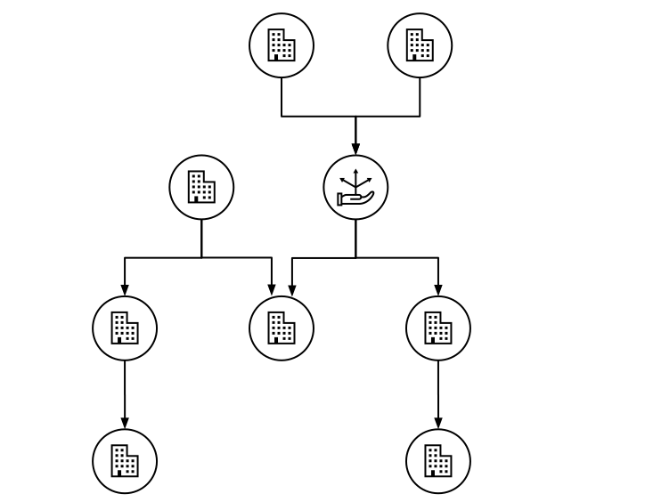

.. _data-model:

What is the BODS data model?
============================

The :doc:`key beneficial ownership concepts <concepts>` and data use cases require a data model which handles:

* Beneficial ownership networks (graphs),
* The changing layout of these networks over time,
* Information about network elements coming from different sources.

The core objects in the data model and their inter-relationships are described below. Understanding the data model will help you design systems which can publish and share beneficial ownership data in BODS format. 

The data model will help you produce usable beneficial ownership data, even if publishing or handling BODS data is not your aim.

.. raw:: html

   <h2>

The data model.

.. raw:: html

   </h2>
   	
larations. A Declaration has one Record as a subject. A Record captures information about a Person, an Entity or a Relationship. A Person has properties: 'name' and 'identifiers'. An Entity has Properties: 'name' and 'identifiers'. A Relationship has properties: 'interestedParty', 'subject' and 'interests'. The interested party of a Relationship may be a single Person or a single Entity. The subject of a Relationship is a single Entity. A Person is the interested party of one or more Relationships. An Entity is the interested party of zero or more Relationships. A Relationship consists of zero or more Interests. An Interest has properties: 'type', 'startDate' and 'endDate'. An interest is part of a single Relationship.)

The core objects (classes) represented in BODS are: Statements, Persons, Entities, Relationships and Interests. Declarations and Records are designated pseudo-objects. Unlike the other elements of the UML class diagram, they are not implemented in BODS' JSON schema as objects: they are implicit.

The properties recorded under each object represent the minimum set of properties which will:

* Maintain the integrity of data derived from the model
* Provide meaningful information about beneficial ownership networks as they change over time

See the :any:`BODS schema <schema-browser>` for the complete set of implemented objects and properties.

.. raw:: html

   <h2>

The model is flexible.

.. raw:: html

   </h2>

The model’s features ensure that it can encapsulate data from a wide range of different systems.

.. raw:: html

   <h3>

Different types of network

.. raw:: html

   </h3>

Data conforming to the model can describe:

1. The legal vehicles which a person controls

2. The people controlling a legal vehicle

3. The people controlling a set of legal vehicles

4. Corporate structures without people

.. raw:: html

   <h3>

Statements

.. raw:: html

   </h3>

Statements encapsulate the datetime (and source) of data recorded about a person, entity or relationship. They help manage data received from multiple sources over extended periods of time, allowing:

* Statements about people, entities or relationships to conflict when they come from different sources
* Statements about people, entities or relationships to overlap, providing complementary information about the same element
* Production of ledger-like histories of beneficial ownership information (to answer questions of ‘who knew what, when?’). This is known as `bi-temporal modelling <https://en.wikipedia.org/wiki/Bitemporal_Modeling>`__.

Statements are immutable (except for rare cases). See the :any:`Generating statements <generating-statements>` page for full requirements.

.. raw:: html

   <h3>

The ``recordId``

.. raw:: html

   </h3>

This property maintains the integrity of data derived from the model. It both:

* Links entities and persons via relationships (to represent network structures in datasets)
* Links statements (to add a historical dimension to datasets) 

See the :any:`BODS schema <schema-reference>` and :any:`Record identifiers <record-identifiers>` pages for full requirements.

.. raw:: html

   <h3>

No intrinsic definition of 'beneficial owner' 

.. raw:: html

   </h3>

There is no definition of 'beneficial ownership' embedded in the data model. Data conforming to the model describes networks of ownership, control and benefit between people and legal vehicles. If a direct or indirect relationship is known to constitute 'beneficial ownership' under a particular definition, a ``beneficialOwnershipOrControl`` property on relevant interests can be set to 'true'. See the :any:`Representing beneficial owners <representing-bo>` page for full requirements.

.. raw:: html

   <h3>

Implementation is in JSON Schema.

.. raw:: html

   </h3>

BODS implements the data model in JSON Schema. The :any:`canonical serialisation <guidance-serialisation>` of BODS data is as a JSON document. BODS data is also streamable in JSON Lines format. BODS JSON is published or streamed as an array of Statement objects.

Statements are *not* grouped within the JSON data structure: either to represent declarations (or filings), or to represent graph components (discrete beneficial ownership networks). The values of the ``declaration`` and ``declarationSubject`` properties allow grouping by data users. (These are properties of the Declaration pseudo-object in the data model, but are implemented as properties of Statements in JSON schema.)

.. raw:: html

   <h2>

The model is a solid basis for data handling.

.. raw:: html

   </h2>

The data model above is not an entity relationship diagram (ERD): it is not a design for a database which outputs BODS data. For example, a database need not have a statement table or even use the concept of 'statement' to be able to export BODS Statements. However, the model can be used to inform database design. 

The model can inform the design of any data management system which will handle corporate structure data or beneficial ownership network data (regardless of any intention to publish BODS data). A design which implements the data model will both: support transfer of data about beneficial ownership networks, and provide a historical dimension to the data.

.. raw:: html

   <h2>

Explore further.

.. raw:: html

   </h2>

Use the :any:`Schema browser<schema-browser>` to explore the data structure of the BODS implementation. Read the :any:`Schema reference <schema-reference>` for detailed definitions and requirements for each object and field.

The objects and fields of the schema allow you to represent a range of real-world situations. Explore related requirements in the :any:`Modelling requirements <modelling-requirements>` section.