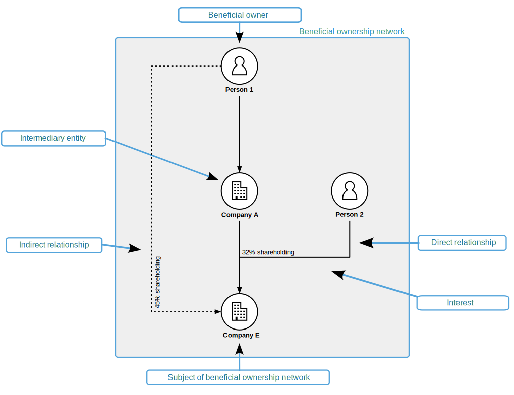

.. _primer:

Primer
======

What is beneficial ownership?
-----------------------------

A beneficial owner is a natural person who holds interests, directly or indirectly, that give them the right to a share of the income or assets of a corporate vehicle, or the ability to control or benefit from its activities.

`Open Ownership <https://www.openownership.org/>`_ uses the term corporate vehicles to refer to both legal entities, such as companies, and legal arrangements, such as trusts. In the Beneficial Ownership Data Standard 'entities' is used to refer to all types of corporate vehicle.

Often entities own other entities, but people almost always appear at the end of beneficial ownership networks. They are the ones who ultimately benefit from the financial successes of the entity, due to their relationship with it.

The beneficial ownership networks connected to entities can be complex and opaque. This means that the identities of the people who own, control, or benefit from entities can remain hidden. If the beneficial owners are hidden, then governments don’t know who is bidding for a contract, companies don’t know who they are doing business with, society doesn’t know who is financing a new political party, and law enforcement can’t fight money laundering and other cross-border financial crimes.

sits on that solid line. Company E is also linked to Company A by a solid line. And Company A is linked to Person 1 by a solid line. Labelled as 'Indirect relationship' is a dotted line connecting Company E to Person 1. The text '45% shareholding' sits on that dotted line. Person 1 is labelled 'Beneficial owner'. Company A is labelled 'Intermediary entity'.
   :figwidth: 85%
   :align: center
   
Beneficial ownership can include all types of relationship with an entity such as ownership, control or benefitting from the entity’s activities. 

If a person owns something, they usually have some control over it. Owning shares in a company may confer voting rights, for example. But ownership and control are sometimes separated - by share classes, contracts, agreements and other mechanisms. For example, an executive director might have the right to appoint 60% of the other board members, while having little financial stake in the business. There are also situations where a person may not have ownership or significant control but still has a relationship which means they benefit from the activities of an entity - for example, where they can enjoy and use assets owned by the entity.

For more `information about beneficial ownership transparency <https://www.openownership.org/en/about/what-is-beneficial-ownership-transparency/>`_ and to read `the latest research <https://www.openownership.org/en/research/>`_, visit `the Open Ownership website. <https://www.openownership.org/en/>`_

.. _whatisbods:

What is the Beneficial Ownership Data Standard?
-----------------------------------------------

The Beneficial Ownership Data Standard (BODS) provides a structured data format, and related requirements, for representing and publishing beneficial ownership information. This is based on the :any:`key concepts <key-concepts>` which underpin beneficial ownership.

Within BODS:

* the :any:`data schema <schema-reference>` describes what data should be shared. It can also inform the design of data collection and management systems. A format called JSON can be used to publish BODS data.
* the :any:`requirements sections <data-standard-index>` set out how information should be represented and managed to conform with the data standard. 

Collecting, sharing and using beneficial ownership information as `structured data <https://www.openownership.org/en/publications/structured-and-interoperable-beneficial-ownership-data/benefits-of-structured-and-interoperable-data/>`_:

* improves the interoperability of beneficial ownership information
* reduces the cost of producing, using, and maintaining beneficial ownership information
* has a greater chance of meeting beneficial ownership transparency policy goals than unstructured data

Without common standards, combining and analysing data from different sources can be expensive and time-consuming, making it more difficult to understand beneficial ownership networks.

BODS allows publishers to provide statements that describe:

* details about natural persons and entities
* identifiers for natural persons and entities
* types of interests that can be held in entities
* provenance information
* historical, as well as current, information
* placeholders, when information must be witheld
