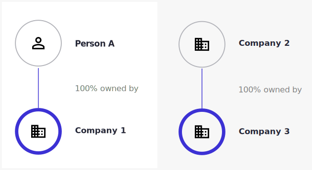
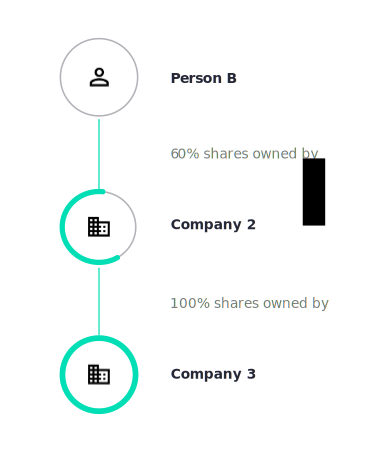
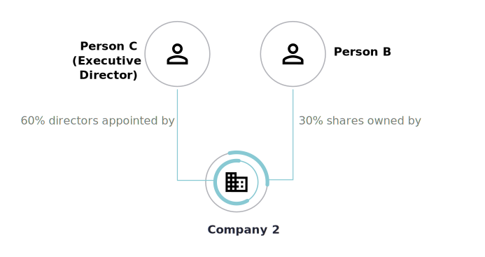

.. _what-is-bo:

What is beneficial ownership?
=============================

The concept of beneficial ownership helps us understand how companies
and other legal entities are owned and controlled.

.. raw:: html

   <h2>

Companies or people can own other companies...

.. raw:: html

   </h2>

The idea that people own companies and sometimes companies own companies
is well understood.

.. raw:: html

   <h2>

...but it's people that ultimately benefit...

.. raw:: html

   </h2>

Even when companies own companies, individuals almost always appear at
the end of the ownership chain. They ultimately benefit from companies’
financial successes, and often share in their failures.

     30% of Company 2's shares

Here, Company 2 acts as an intermediary in a chain of ownership.

.. raw:: html

   <h2>

...so, we need to know who ultimately controls a company...

.. raw:: html

   </h2>

If a person owns something, they usually have some control over it.
Owning shares in a company may confer voting rights, for example. But
ownership and control are sometimes separated - by share classes,
contracts, agreements and other mechanisms. For example, an executive
director might have the right to appoint 60% of the other board members,
while having little financial stake in the business.

     executive director) has the right to appoint 60% of Company 2's board
     members

Significant control over a company’s composition and decisions may be
used to steer benefits and direct risks. Those people taking the
financial risks for a company may not be the ones making the decisions.
In which case, we need to know who is in control.

.. raw:: html

   <h2>

...to see the big picture.

.. raw:: html

   </h2>

Beneficial ownership therefore takes in both types of involvement with a
company: ownership and control.

.. highlights::

    **Beneficial ownership** is the right to some share of a legal entity's income or assets (ownership) or the right to direct or influence the entity's activities (control).

