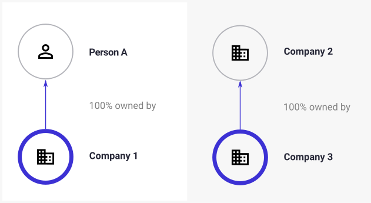
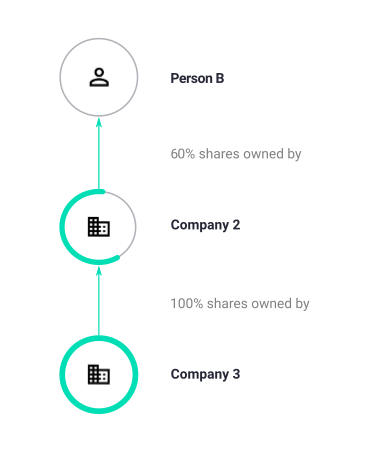
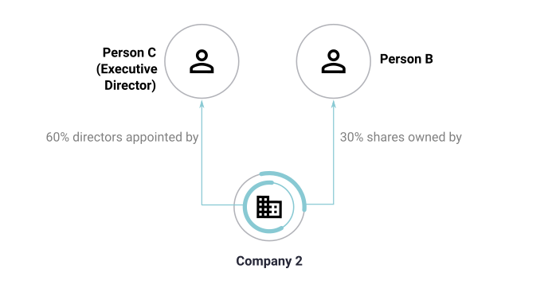

.. _what-is-bo:

What is beneficial ownership?
=============================

The concept of beneficial ownership helps us understand how people own, control and benefit from companies and other legal vehicles, like trusts. Beneficial ownership derives from share ownership, benefiting from assets or business activities, or controlling business activities.

.. raw:: html

   <h2>

Companies or people can own other companies.

.. raw:: html

   </h2>

The idea that people own companies and sometimes companies own companies is well understood.

.. raw:: html

   <h2>

People ultimately benefit.

.. raw:: html

   </h2>

Even when companies own companies, individuals almost always appear at the end of the ownership chain. They ultimately benefit from companies’ financial successes, and often share in their failures.

Here, Company 2 is an intermediary in a chain of ownership.

.. raw:: html

   <h2>

Know who ultimately controls a company.

.. raw:: html

   </h2>

If a person owns something, they usually have some control over it. Owning shares in a company may confer voting rights, for example. But the rights conferred by ownership are sometimes split up - by share classes, contracts, agreements and other mechanisms. For example, an executive director might have the right to appoint 60% of the other board members, while having little direct financial stake in the business.

Significant control over a company’s composition and decisions may be used to steer benefits and direct risks. Those people taking the financial risks for a company may not be the ones making the decisions. In which case, we need to know who is in control.

.. raw:: html

   <h2>

See the big picture.

.. raw:: html

   </h2>

Beneficial ownership therefore covers various types of involvement with a company: ownership, control and enjoyment of its assets.

Understanding who the beneficial owners are of different legal vehicles helps governments, citizens and companies know who they are really doing business with.

.. highlights::

    **Beneficial ownership**  is a natural person’s right to some share or enjoyment of a corporate vehicle’s income or assets (ownership), or the right to direct or influence its activities (control). Ownership and control can be exerted either directly or indirectly.

