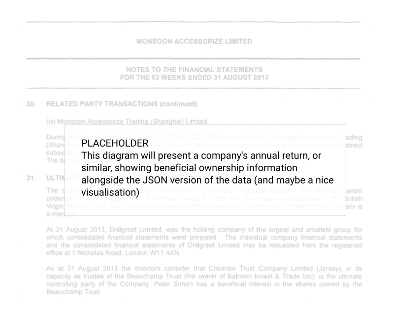

.. _whatisbods:

What is the Beneficial Ownership Data Standard (BODS)?
======================================================

The Beneficial Ownership Data Standard (BODS) provides a common way of organising and sharing information about who owns, controls and benefits from companies and other legal vehicles, independent of any particular definition of "beneficial owner". It is designed so that beneficial ownership networks (corporate structures) can be easily revealed. Its aim is to make combining and analysing data from different sources easier, cheaper and quicker.

.. raw:: html

   <h2>

BODS is not a regulatory framework or an industry standard.

.. raw:: html

   </h2>

BODS is a technical standard for structuring data about beneficial ownership. 

Standards such as the FATF requirements or the EITI Standard mention beneficial ownership but they are not technical standards. They provide normative guidance for policy-makers and industry actors, aiming to shape best practice in government and industry.

.. raw:: html

   <h2>

BODS offers a structure for sharing beneficial ownership information.

.. raw:: html

   </h2>

Information about beneficial ownership encompasses:

* Details of legal vehicles, such as companies and trusts
* Share ownership
* The voting rights attached to different share classes
* Details which identify individual people
* Details of intermediate legal vehicles in an ownership chain
* And more

This information can be scattered across companies’ annual reports, their founding articles, filings to regulatory authorities, and contracts. BODS provides fields and field sets into which this information can be organised and represented as data when it is exported.

BODS is not a format for storing beneficial ownership data.

.. raw:: html

   <h2>

BODS has a specified data format.

.. raw:: html

   </h2>

The data schema describes the organisation of these fields and field sets. The schema is defined in a popular structured data format called JSON.

     the related structured data representation of these documents is on the right, in JSON.
   :figwidth: 90%
   :align: center

.. raw:: html

   <h2>

Its fields are well-defined.

.. raw:: html

   </h2>

Every field and object in the :any:`BODS schema <schema-reference>` has a clear definition. For example, here are some fields that would be used to describe a company:

.. jsonschema:: ../_build_schema/entity-record.json
   :include: name,jurisdiction,foundingDate
   :allowexternalrefs:
   :allowurnrefs:

Alongside field-level definitions, :any:`Modelling requirements <modelling-requirements>` define how different scenarios should be represented in BODS data.

.. raw:: html

   <h2>

BODS data can be transferred and interpreted.

.. raw:: html

   </h2>

JSON format facilitates computerised access to and analysis of BODS data, whilst also being human-readable. JSON is a well-supported format for applications which import, export or process data.

.. raw:: html

   <h2>

BODS data reveals beneficial ownership networks.

.. raw:: html

   </h2>

When beneficial owners indirectly control companies, it is valuable to understand the networks of control. BODS has a network-first design. It organises information into three categories: that about entities, about people, and about the relationships between them.

.. figure:: ../_assets/data-model-bottom-up.svg
   :alt: A tree-shaped graph with one entity root node at the bottom and five other nodes above (three of which are person leaves).
   :figwidth: 32%
   :align: center

BODS data can therefore be processed with ease to reveal networks.