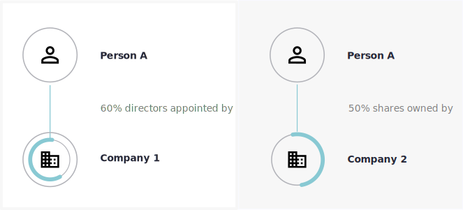
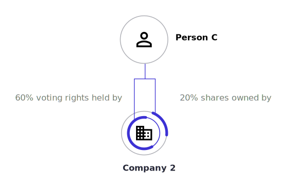

Why beneficial ownership is a useful concept
============================================

People can be involved in a number of companies and in different ways.
By limiting our understanding of people's involvement to ownership only,
we would miss instances like below.

     Company 3

The person both controls Company 1 and owns half of Company 2. This
could be important to know if both companies bid for the same government
contract, or if they both appeared in a procurement chain.

It might be equally important to see that a person's control over a
company is greater than one might expect given their financial stake in
it.

     20% of its stock.

.. highlights::

   Uniting ownership and control under the banner of beneficial ownership allows us to represent the complex reality of corporate structures, and the multiple interests a person might have in a company.
