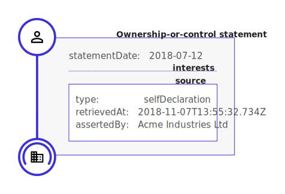

.. _key-concepts:

Key concepts
============

The concept of a 'statement' is at the heart of the Beneficial Ownership Data Standard. BODS data consists of a collection of ordered statements describing:

* Ownership or control
* Entities (including companies, trusts and arrangements)
* Natural persons (who ultimately own or control entities)

Statements
-----------

Details of how an interested party controls or owns a company or other legal entity are wrapped in an ownership or control statement.

.. figure:: ../_assets/data-schema-model-1.svg
   :alt: A ownership or control statement block containing two 'interests': one a 60% share-holding interest, the other a 30% voting-rights interest

Details of the subject of an ownership or control statement and its interested party are wrapped in their own statements. The ownership or control statement refers out to these statements, acting as a connector.

.. figure:: ../_assets/data-schema-model-2.svg
   :alt: An ownership or control statement block containing two 'interests': one a 60% share-holding interest, the other a 30% voting-rights interest

The :any:`schema reference <schema-reference>` defines in detail the fields that each statement should have, and how they should be structured.

Statements as claims
--------------------

Each statement represents a claim about beneficial ownership made by a particular source at a particular point in time.

Modelling beneficial ownership information in this way allows us to make sense of data received from multiple sources over extended periods of time. In particular, it allows:

* Statements about beneficial ownership to conflict
* Statements about beneficial ownership to overlap
* Production of historical beneficial ownership snapshots (to answer questions of 'who knew what, when?'). This is known as `bi-temporal modelling <https://en.wikipedia.org/wiki/Bitemporal_Modeling>`_. 

When representing data conforming to BODS, users should therefore handle statements with due care. Ultimately it is up to data consumers to decide which statements to trust, and to verify identities using the :any:`identifying information <guidance-identifiers>` contained in ``Person`` and ``Entity`` statements.

Data model overview
-------------------

The canonical representation of each statement is a JSON object with a `statementIdentifier` and `statementType`. The `statementIdentifier` exists solely for the purpose of cross-referencing between statements. 

**``Person`` and ``Entity`` statements** both contain a set of fields that can be used to discover the real-world identify of the entity or individual. These include:

* An ``identifiers`` array that is used to provide known identifiers such as company registration for firms, or publicly shareable taxpayer identifiers for individuals. 
* Jurisdiction or Nationality information
* Important dates (birth date, death date, foundingDate, dissolutionDate)
* Addresses
  
These fields are designed to support 'strict' and 'relaxed' validation, to accommodate different data sources. New data sources should seek to provide the data required for strict validation, such as country codes, and full dates. Other sources should provide as much data as possible, subject to relevant policy and privacy constraints. 

An **ownership or control statement** contains a reference to a statement describing an entity (the ``subject`` of the statement), and an ``interestedParty`` reference to either:

* A statement describing another entity which has ownership or control interests in the subject;
* A statement describing a person who has an ownership or control interest in the subject; or
* An unspecified party and the reasons that no ownership or control can be specified. 

The ownership and control statement then contains an array of `interests`, each with a type (specified by the interestType codelist) and, where relevant, percentages indicating the size of the interest. 

Use the schema browser to see the structure of each statement, or check the :any:`schema reference <schema-reference>` for detailed definitions of each field. 

Ownership or control through arrangements
------------------------------------------

In some cases ownership or control is exercised through:

* Trusts;
* Contracts; and
* Other arrangements

Depending on the particular jurisdiction these are covered by, they may or may not have an registered legal identity. 

In BODS arrangements such as these are treated as a special kind of ``Entity``, expressed with ``entityType``='arrangement'. 

This allows control via arrangements to be modelled in two steps, describing how:

* Person P has an interest in Arrangement A
* Arrangement A has an interest in Entity E

For more guidance on modelling arrangements, contact the :any:`BODS Helpdesk <support>`.

Direct and indirect ownership and control
-----------------------------------------

BODS can be used to describe both direct ownership and control (where Person A has a direct share in Company B), or indirect ownership and control (Where Person A is an ultimate beneficial owner of B, but where there may be any number of known or unknown intermediate companies or arrangements). This is indicated by use of the ``interestLevel`` property that can be set for each interest declared. 

Sources, provenance and annotations
-----------------------------------

Each statement should contain information on its source, and whether or not the information it contains has been verified. For example, a statement may be taken from official records, or self declaration - and it may or may not have been checked through some process to verify that the information provided is accurate. 

In some cases, systems processing BODS data may make changes to clean, enhance or otherwise update the data, such as reconciling company names against identifiers. Details of these changes should be recorded as annotations, to allow users to clearly understand the provenance of information.

Immutability of statements
--------------------------

A collection of BODS statements should be treated as a write-only ledger, with new statements appended on the end. 

Statements must be treated as immutable: once a statement is published it must not be republished with the same ``statementID`` but different field values. 

If a particular field needs to be updated, a new statement with a new ``statementID`` must be published and the ``replacesStatement`` property used. See :any:`Updating statements <guidance-updating-data>`
