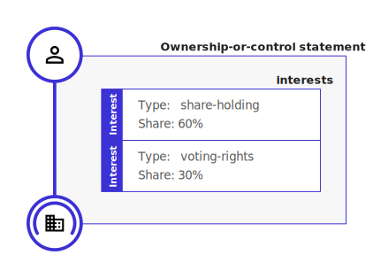

.. _key-concepts:

Key concepts
============

.. attention:: 
    
    This is v0.2 of the Beneficial Ownership Data Standard. It includes updates to the data model and additional codelist information. Implementers should be aware that future changes are anticipated, before a version 1.0 release. See the :doc:`Changelog <changelog>` and `About <../about>`_ pages for more information.

    **MUST** and **SHOULD** are used in the schema to denote required and recommended elements of the Standard, as defined in `RFC2119 <https://tools.ietf.org/html/rfc2119>`_.

The concept of a 'statement' is at the heart of the Beneficial Ownership Data Standard. BODS data consists of a collection of ordered statements describing:

* Ownership or control
* Entities (including companies, trusts and arrangements)
* Natural persons (who own or control entities)

Statements
-----------

Details of how an interested party controls or owns a company or other legal entity are wrapped in an ownership-or-control statement.

Details of the subject of an ownership-or-control statement and its interested party are wrapped in their own statements. The ownership-or-control statement refers out to these statements, acting as a connector.

.. figure:: ../_assets/data-schema-model-2.svg
   :alt: A person statement linked to an ownership-or-control statement linked to an entity statement.

Together, the statements above tell us that Roberto Lopez has some kind of controlling or ownership stake in RENCO Energy Ltd.

The :any:`schema reference <schema-reference>` defines in detail the fields that each statement should have, and how they should be structured.

Statements as claims
--------------------

Each statement represents a claim about beneficial ownership made by a particular source at a particular point in time.

.. figure:: ../_assets/data-schema-model-3.svg
   :alt: An ownership-or-control statement block containing a source block with type-selfDeclaration, retrievedAt date of 2018-11-07T13:55:32.734Z and assertedBy value of Acme Industries Ltd. Statement also has statementDate of 2018-07-12

Modelling beneficial ownership information in this way allows us to make sense of data received from multiple sources over extended periods of time. In particular, it allows:

* Statements about beneficial ownership to conflict
* Statements about beneficial ownership to overlap
* Production of historical beneficial ownership snapshots (to answer questions of 'who knew what, when?'). This is known as `bi-temporal modelling <https://en.wikipedia.org/wiki/Bitemporal_Modeling>`_. 

When representing data conforming to BODS, users therefore need to handle statements with due care. Ultimately it is up to data consumers to decide which statements to trust, and to verify identities using the :any:`identifying information <guidance-identifiers>` contained in ``personStatements`` and ``entityStatements``.

Data model overview
-------------------

Statements are specified in the data schema as JSON objects:

- :any:`Ownership-or-control statement <schema-ownership-or-control-statement>`
- :any:`Entity statement <schema-entity-statement>`
- :any:`Person statement <schema-person-statement>`

Each statement has a ``statementIdentifier`` and ``statementType`` field. The ``statementIdentifier`` exists solely for the purpose of connecting statements. 

- **Entity statements** are used to describe registered legal entities that are the subject of legal ownership (such as companies, non-registered entities (such as trusts), and artificial entities (such as joint shareholding arrangements).
- **Person statements** describe the natural persons who stand in relationships of ultimate beneficial ownership or control
- **Ownership-or-control statements** describe the interest(s) held by one entity in another, or a person in an entity. They are connected to those entities and persons using ``statementIdentifier`` references.

All statements have ``source`` and ``annotations`` properties which can provide an audit trail describing where information was obtained from, when, and any verification of the information that has taken place. See :ref:`Sources and annotations <provenance>` for guidance.

``personStatements`` and ``entityStatements`` both contain a set of fields that can be used to disclose the real-world identity of the entity or individual. These include:

* An ``identifiers`` array that is used to provide known identifiers such as company registration for firms, or publicly shareable taxpayer identifiers for individuals. 
* Jurisdiction or Nationality information
* Important dates (birth date, death date, founding date, dissolution date)
* Addresses

Including such identifiers allows intelligent integration of information across disclosures, datasets and time.
  
These fields are designed to support 'strict' and 'relaxed' validation, to accommodate different data sources. New data sources should seek to provide the data required for strict validation, such as country codes, and full dates. Other sources should provide as much data as possible, subject to relevant policy and privacy constraints. 

An ``ownershipOrControlStatement`` connects (via ``statementIdentifier`` references) the ``subject`` of the statement (an entity described by an ``entityStatement``) and an ``interestedParty``. This interested party may be: 

* Another entity described by an ``entityStatement``;
* A person described by a ``personStatement``; or
* An unspecified party and the reasons that no ownership or control can be specified. 

The ownership-or-control statement also contains an array of ``interests``, each with a type (selected from the `interestType codelist <reference.html#interesttype>`_) and, where relevant, percentages indicating the size of the interest. 

To explore the structure of the data model in full use the :doc:`Schema browser <schema-browser>`. Or read the :any:`Schema reference <schema-reference>` for detailed definitions of each object and field. 

Ownership or control through arrangements
------------------------------------------

In some cases ownership or control is exercised through:

* Trusts;
* Contracts; and
* Other arrangements

Depending on the particular jurisdiction these are covered by, they may or may not have a registered legal identity. 

In BODS arrangements such as these are treated as a special kind of ``entityStatement`` with ``entityType`` value: 'arrangement'. 

This allows control via arrangements to be modelled in two steps, describing how:

* Person P has an interest in Arrangement A
* Arrangement A has an interest in Entity E

For more guidance on modelling arrangements, contact the :any:`BODS Helpdesk <support>`.

Direct and indirect ownership and control
-----------------------------------------

BODS can be used to describe both direct ownership and control (where Person A has a direct share in Company B), or indirect ownership and control (Where Person A is an ultimate beneficial owner of B, but where there may be any number of known or unknown intermediate companies or arrangements). This is indicated by use of the ``interestLevel`` property that can be set for each interest declared. 

Immutability of statements
--------------------------

Published BODS statements should be treated as a write-only ledger, with new statements being issued to amend data contained in older statements and those new statements appended to the ledger. See :any:`Updating statements <guidance-updating-data>` for further guidance.
