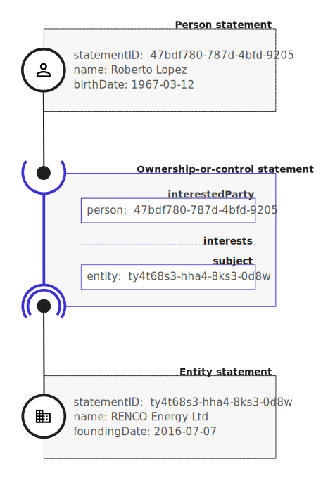

Schema reference
================

```eval_rst 

.. attention:: 
    
    This is the **beta** of the schema. This version is ready for test implementations. 

    Implementers should be aware that future changes are anticipated, before a version 1.0 release. However, from this beta release onwards, any structural changes, or major definitional changes will only take place following consultation, with a clear changelog provided, and with the documentation of previous versions maintained in archive form. 

    The schema contains a draft **structure** and **fields** but does not yet specify substantial constraints or explicit required fields. 

```

## Introduction

The Beneficial Ownership Data Specification (BODS) provides a common data model for representing the direct or indirect relationships of ownership and control of some entity (such as a company) by some other entities (including trusts and joint shareholdings) or by natural persons. 

This data model is intended for use in the representation of information on Ultimate Beneficial Ownership, whereby the natural persons who ultimately benefit from, or control, and entity, are declared. 

## Conceptual model

Data is published as a series of related statements. Each statement represents information provided by a particular source at a particular point in time. 



**Statements describe:**

* [Entities](#entitystatement) - including registered legal entities that are the subject of ownership such as companies, as well as non-registered entities such as trusts, and artificial entities such as joint shareholding arrangements
* [Persons](#personstatement) - providing details of the natural persons who stand in  relationships of ultimate beneficial ownership or control
* [Beneficial Ownership Interests](#beneficialownershipStatement) - providing details of the interest held by one entity in another, or one person in an entity by reference to the statements that describe those entities and persons

Provenance information (sources) and annotations can be attached to each statement to provide an audit trail on where information was obtained from, and any verification of the information that has taken place. 

Both entity and person statements include name and identifier blocks that can be used to relate them to real world entities or persons, and allow intelligent integration of information across disclosures, datasets and time. 

## Serialization

The canonical serialization of BODS data is as a [JSON document](https://tools.ietf.org/html/rfc8259). A JSON BODS file SHOULD consists of a series of ordered statements within a top-level array. 

Each of the entityStatements or personStatements referenced by a particular [beneficialOwnershipStatement] MUST appear before that particular statement in the ordered array. 

BODS data MAY also be serialized in tabular form, using the relative JSON Pointer from the statement root for each relevant field as the column header. For example, the extract:

``` json
  {
    "statementID": "1dc0e987-5c57-4a1c-b3ad-61353b66a9b7",
    "statementType": "entityStatement",
    "identifiers": [
      {
        "scheme": "GB-COH",
        "id": "07444723"
      }
    ]
  }
```

may be serialized in a table as:

&nbsp;<table><thead><tr><th>statementID</th><th>statementType</th><th>identifiers/scheme</th><th>identifiers/id</th></tr></thead><tbody><tr><td>1dc0e987-5c57-4a1c-b3ad-61353b66a9b7</td><td>entityStatement</td><td>GB-COH</td><td>07444723</td></tr></tbody></table>

## Statement Identifiers

DETAILS OF STATEMENT IDENTIFIERS HERE

## Components

The schema consists of a number of components which are detailed below, along with their definition and data types.

Statements: [Ownership or control statements](#beneficialownershipstatement); [Entity statements](#entitystatement); [Person statements](#personstatement)

Common components: 

<!--TODO - CHECK THIS -->Statements must be packaged up in a [statement package](#statement-packages) for a [data release](building-data-releases.md).

### OwnershipOrControlStatement

An ownership or control statement is made up of statements about an entity, an interestedParty (either an entity, a person or null party), and details of the interest. Additionally, annotations on the interest, provenance and versioning information can be provided.

```eval_rst
.. jsonschema:: ../../schema/ownership-or-control-statement.json
    :collapse: interests,source,annotations
```

### EntityStatement

```eval_rst
.. jsonschema:: ../../schema/entity-statement.json
   :collapse: identifiers,addresses,source
```

### PersonStatement

```eval_rst
.. jsonschema:: ../../schema/person-statement.json
   :collapse: names,identifiers,source,placeOfResidence,placeOfBirth,addresses
```

### Interest

```eval_rst
.. jsonschema:: ../../schema/components.json
   :pointer: /definitions/Interest
   :collapse: share,annotations
```

### Share

```eval_rst
.. jsonschema:: ../../schema/components.json
   :pointer: /definitions/Interest/properties/share
```

### Name

```eval_rst
.. jsonschema:: ../../schema/components.json
   :pointer: /definitions/Name
```

### Identifier

The identifier component is used to connect a statement to the real-world person or entity that it refers to, using one or more existing known identifiers. See [Real world identifiers](identifiers.md) for technical guidance on when and how to use this component.


```eval_rst
.. jsonschema:: ../../schema/components.json
   :pointer: /definitions/Identifier
```

### Address

Due to the diversity of address formats used across systems, and the extent to which data is inconsistently entered across these data fields in source systems and legacy datasets, the schema uses a very simple address format for data exchange - relying upon consuming systems to parse addresses before carrying out any structured comparison. However, designers of new data collection systems are encouraged to choose an appropriate structured format, with reference to established standards, and awareness of the need to accomodate addresses from across the world. See [issue 18](https://github.com/openownership/data-standard/issues/18) for more details.

```eval_rst
.. jsonschema:: ../../schema/components.json
   :pointer: /definitions/Address
```

### Source

See [the provenance pages](provenance.md) for a discussion of provenance modelling.

```eval_rst
.. jsonschema:: ../../schema/components.json
   :pointer: /definitions/Source
```

### Annotation

The annotation property currently allows for an array of simple annotation objects. This is a placeholder which could be extended in future to include structured information qualifying the nature of the interest held.

```eval_rst
.. jsonschema:: ../../schema/components.json
   :pointer: /definitions/Annotation
```

### StatementDate

See https://github.com/openownership/data-standard/issues/12 for a discussion of handling fuzzy dates.

Our current schema uses a regular expression to allow YYYY, YYYY-MM, YYYY-MM-DD or full datetimes. 

### ReplacesStatement
See [Updating statements](updating-statements.md) for technical guidance on when and how to use this property.


### Statement packages

At the top level of any structured file are arrays (packages) of statements. All the statements in a package must be the same type of object; that is, all ```beneficialOwnershipStatements```, all ```entityStatements```, all ```beneficialOwnershipStatements```, or similar. See [Building a release package](building-release-package.md) for technical guidance.

```eval_rst
.. jsonschema:: ../../schema/bods-package.json
```

## Modelling notes

This section will outline some of the more complex modelling decisions, such as:

* Trusts - modelled as an entity, with a BO statement for each trustee etc.
* Joint Shareholding - modelled as an artificial entity with each joint shareholder related by a BO statement to the artificial joint shareholding entity
* Agreements - modelled as a qualification/annotation on an interest


TODO.


## Normative references

* JSON: https://tools.ietf.org/html/rfc8259 

