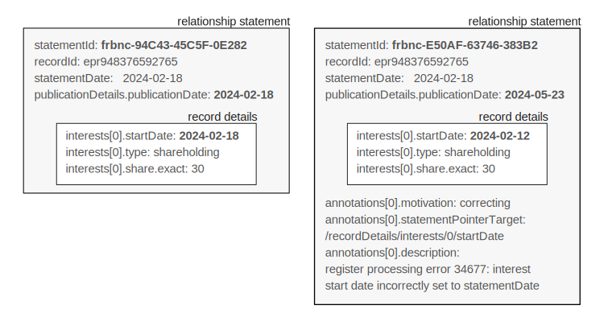

.. _guidance-dates:

Dates guidance 
==============

Key dates
---------

In BODS, dates represent real world events and information about how data has moved through a system. 

``statementDate`` is the date that the information about the entity, person or relationship is claimed to be true. This could be recorded automatically when someone submits an online declaration form or be the submission date listed on a physical form. For a service consolidating beneficial ownership data, it would be the date on which several sources of information were resolved to make a coherent claim about the state of an entity, person, or relationship.

``publicationDetails.publicationDate`` is the date this statement was published. For example, the date the information was added to a public registry, or made available via an API. This can be the same as the statementDate if data is published immediately after submission. In many cases there will be a delay between submission and publication.	

``interest.startDate`` is the date an interest started. For example, the date shares were purchased or the day that someone was appointed to the board of directors.

``interest.endDate`` is the date an interest ended. For example, the day shares were divested of or someone resigned from the board of directors.

``source.retrievedAt`` is only applicable where data is being republished. For example, some 3rd parties might download data from government registries, transform it into BODS format and share it elsewhere. When this is done, they must provide information on when they downloaded the data from the government registry. 

Date rounding
-------------

For some fields, when exact dates are required but not known, rounded dates may be published. This is indicated in the schema description for those fields. 

Where a month is known but not the day, the first day of the month can be used. Where a year is known but not the month, the first day of the year can be used. 

Where rounded dates are used this should be noted in the publisher’s accompanying guidance for data users. `See building an auditable record of beneficial ownership <https://www.openownership.org/en/publications/building-an-auditable-record-of-beneficial-ownership/feature-five-publication-policy/>`_

For example:

* If an interest started in March 2022 but the exact day is not known ``interest.startDate`` would be published as 2022-03-01
* If an interest started in 2022 but the exact month and day is not known ``interest.startDate`` would be published as 2022-01-01 

Examples
--------

An interest ending
^^^^^^^^^^^^^^^^^^
.. figure:: ../../_assets/dates-guidance1.svg
   :alt: A statement with statement date 2019-09-10, publication date 2021-09-13 and interest end date 2021-09-3.
   :figwidth: 65%
   :align: center

From this closing statement we can construct a timeline of events for this interest

.. figure:: ../../_assets/dates-guidance2.svg
   :alt: The dates from the above statement on a timeline showing the relationship ending, the change being reported and the change being published.
   :figwidth: 65%
   :align: center
   
   
A confirmation process 
^^^^^^^^^^^^^^^^^^^^^^

Someone founds a company and registers it. One year later nothing has changed. They file a confirmation statement and a new statement is generated with an updated statementDate and publicationDate. 

.. figure:: ../../_assets/dates-guidance3.svg
   :alt: 2 statements showing the same interest start date and entity founding date. The statement date and publication date are one year apart. 
   :figwidth: 65%
   :align: center
   
An error correction
^^^^^^^^^^^^^^^^^^^

Due to an error in the publication system, a relationship statement is published with an incorrect interest.startDate. To correct this, a new statement is published replacing the incorrect one. 

. 
   :figwidth: 65%
   :align: center

The new statement:

* has the same statementDate, as the information originally submitted has not changed
* had a new publication date 
* has a corrected interest.startDate
* has an annotation explaining the correction

