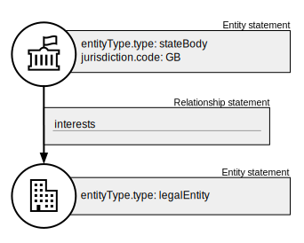
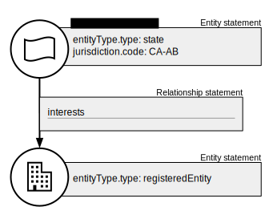
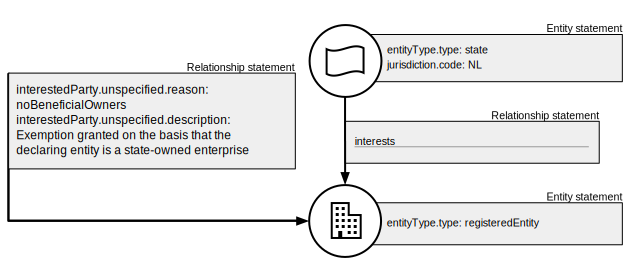
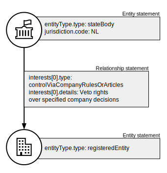
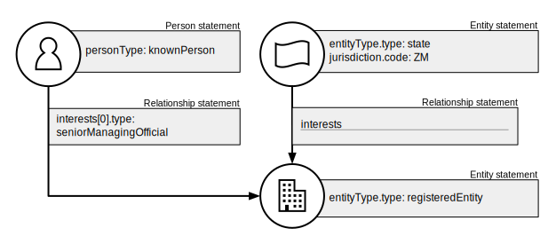

.. _representing-soes:

Representing state-owned enterprises
========================================

.. highlights::

    **Key requirement:** If an entity's status as a state-owned enterprise needs to be represented, then its Entity statement MUST be the subject of Ownership-or-control statement(s) connecting it, either directly or indirectly, to an Entity statement with ``entityType`` of 'state' or 'stateBody'.

Overview
------------------------

The definition of 'state-owned enterprise' (SOE) can change according to jurisdiction or domain. The Beneficial Ownership Data Standard (BODS) does not therefore rely on, or support, any one definition. Instead, BODS enables the interests between a state (or state body) and an enterprise to be represented. This requires the state itself (or state body) to be represented by an Entity statement.

In particular, the following properties and values SHOULD be used to represent information about enterprises and their links to states:

* ``entityType`` SHOULD be set to 'state' or 'stateBody', and ``jurisdiction`` SHOULD be used to represent the particular state.
* ``entitySubtype`` SHOULD be used to refine the category of a given state body (as a 'government department', 'state agency' or 'other').
* ``formedByStatute`` MAY be used to supply details of a law, where an entity has been formed as a result of specific legislation.

For more details about these properties see :ref:`schema-entity-statement`.

A number of scenarios are outlined below. We show how the these properties and others can be used to represent information about SOEs within a set of connected BODS statements. 

Example scenarios
------------------------

These examples show how statements might be connected to represent the involvement of a state with an enterprise. Only those property:value pairs that are particularly relevant to the scenario are shown in the statement blocks. Complete data would also show, for instance, the particular types of interests held by the state, such as an 80% shareholding. 

Scenario 1
^^^^^^^^^^

Ownership-or-control by a state is known and a statement about ownership is possible.

Scenario 2
^^^^^^^^^^

Ownership-or-control by a state body is known and a statement about ownership is possible.

Scenario 3
^^^^^^^^^^

A registered entity declares that it is exempt from disclosing beneficial owners because it is an SOE.

n Ownership-or-control statement which has interestedParty.unspecified.reason set to 'noBeneficialOwners' and interestedParty.unspecified.description set to 'Exemption granted on the basis that the declaring entity is a state-owned enterprise'.
   :figwidth: 85%
   :align: center

Scenario 4
^^^^^^^^^^

Describing control through a golden share provision in company articles or shareholder agreement.

CompanyRulesOrArticles' and interests.0.details set to 'Veto rights over specified company decisions'.
   :figwidth: 50%
   :align: center

Scenario 5
^^^^^^^^^^

Describing control of an SOE by a natural person.

n Ownership-or-control statement which has interests.0.type set to 'seniorManagingOfficial'. That last Ownership-or-control statement is connected to a Person statement with personType set to 'knownPerson'.
   :figwidth: 85%
   :align: center

Scenario 6
^^^^^^^^^^

An SOE is formed by statute.

.. figure:: ../../_assets/SOE-scenario6.svg
   :alt: Entity statement (with entityType 'legalEntity', formedByLegislation.name set to 'National Energy Act', and formedByLegislation.date set to '1980-02-01') is connected via an Ownership-or-control statement to an Entity statement (with entityType 'stateBody' and jurisdiction 'zm'). The Ownership-or-control statement has interests.0.type set to 'controlByLegalFramework'.
   :figwidth: 50%
   :align: center

Scenario 7
^^^^^^^^^^

A state's interests in an SOE are managed via a government-linked investment entity (GLIE).

.. figure:: ../../_assets/SOE-scenario7.svg
   :alt: Entity statement (with entityType 'registeredEntity') is connected via an Ownership-or-control statement to another Entity statement with entityType 'registeredEntity' and name 'A G.L.I.E'. That latter Entity Statement is connected via an Ownership-or-control statement to an Entity statement (with entityType 'state' and jurisdiction 'gb').
   :figwidth: 50%
   :align: center

