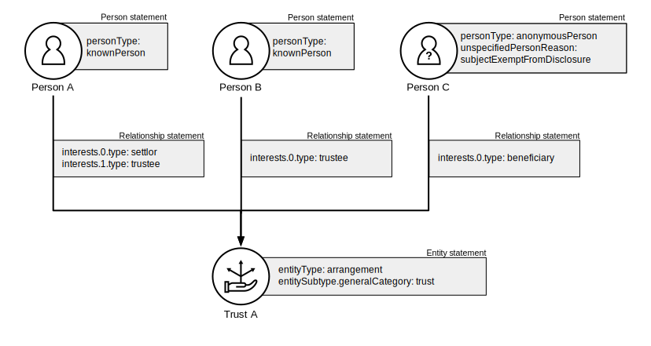
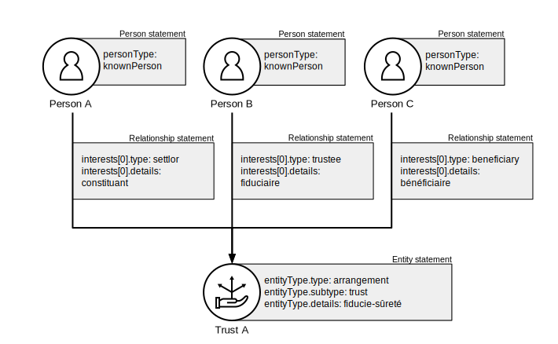

.. _representing-trusts:

Representing trusts and trust-like arrangements
===============================================

Overview
--------
In this documentation the term ‘trust’ is inclusive of trusts and trust-like arrangements (such as fiducie, treuhand and waqf). 

BODS can be used to represent the beneficial ownership of trusts and the beneficial ownership of entities via trusts. Trusts are represented by an Entity statement. 

When representing trusts:

* If the trust has legal personality ``entityType`` MUST be ``legalEntity``
* If the trust does not have legal personality ``entityType`` MUST be ``arrangement``
* ``entitySubtype/generalCategory`` MUST be ``trust``
* ``entitySubtype/localTerm`` MAY be used to give a local name (e.g. "fiducie") or specify the type of trust (e.g. "inter-vivos trust")

Relationships between trusts and their parties MUST be represented using only these ``interest/type`` codes:

* ``settlor``
* ``beneficiary``
* ``trustee``
* ``protector``
* ``otherInterestOrControl``

``interest/details`` MAY be used to give a local name (e.g. "fiduciaire") or additional information about the interest (e.g. "power to dissolve trust") 

Example Scenarios 
-----------------
These examples show how statements could be connected to represent ownership networks involving trusts. Only the property:value pairs that are relevant to the scenario are shown in the statement blocks. 

Scenario 1
^^^^^^^^^^
A trust with a beneficiary, trustee and settlor. The trust does not have a legal personality.

.. figure:: ../../_assets/trust-scenario1.svg
   :alt: entity statement labeled Trust A with entityType 'arrangement' and entitySubtype generalCategory 'trust.' Trust A is connected to person A by a relationship statement with interest type 'settlor', person B by a relationship statement with interest type 'trustee', and person C by a relationship statement with interest type 'beneficiary'
   :figwidth: 100%
   :align: center
   
Scenario 2
^^^^^^^^^^
A trust with a beneficiary, trustee and settlor and protector. The trust has a legal personality. 

.. figure:: ../../_assets/trust-scenario2.svg
   :alt: entity statement labeled Trust A with entityType 'legalEntity' and entitySubtype generalCategory 'trust.'  Trust A is connected to person A by a relationship statement with interest type 'settlor', person B by a relationship statement with interest type 'trustee', person C by a relationship statement with interest type 'beneficiary', and person D by a relationship statement with interest type 'protector'
   :figwidth: 100%
   :align: center
   
   
Scenario 3
^^^^^^^^^^
A trust where the settlor and beneficiary are also both trustees. 

e'
   :figwidth: 100%
   :align: center

Scenario 4
^^^^^^^^^^
A trust-like arrangement where local names are provided for the entityType and interestTypes. 

ails 'constituant', person B by a relationship statement with interest type 'trustee' and interest details 'fiduciaire', and person C by a relationship statement with interest type 'beneficiary' and interest details 'beneficiaire'
   :figwidth: 100%
   :align: center

Scenario 5
^^^^^^^^^^
A trust that owns shares in a company. The beneficial owners of the trust are the beneficial owners of the company. Overarching relationship statements are represented by dotted lines. 

See `representing beneficial ownership <repr-beneficial-ownership>`_ for guidance on representing indirect beneficial ownership.

.. figure:: ../../_assets/trust-scenario5.svg
   :alt: Company A is owned by Trust A and there is a relationship statement between them with interest type 'shareholding.' Trust A has a settlor, Person A, a trustee, Person B and a beneficiary, Person C. There are dotted lines between Company A and Person A, Person B and Person C to represent that they are the ultimate beneficial owners of Company A. 
   :figwidth: 100%
   :align: center
   
Scenario 6
^^^^^^^^^^
A trust where the trustee is a company. The owner of the company is a beneficial owner of the trust. The indirect relationship statement is represented by a dotted line. 

See `representing beneficial ownership <repr-beneficial-ownership>`_ for guidance on representing indirect beneficial ownership.

.. figure:: ../../_assets/trust-scenario6.svg
   :alt: Trust A is linked to Company A by a relationship statement with interest type trustee. Company A is linked to Person C by a relationship statement with interest type shareholding. There is also a dotted line between Person C and Trust to represent that they are one of the ultimate beneficial owners of Trust A. The dotted line has a relationship statement attached with interest type 'other interest or control.' There are also Person A and Person B the settlor and beneficiary of the trust. 
   :figwidth: 100%
   :align: center
   
   
Further Guidance 
----------------

The `Open Ownership website <https://www.openownership.org/en/topics/trusts-and-legal-arrangements/>`_ has more guidance and research on capturing beneficial ownership information about trusts and legal arrangements.

