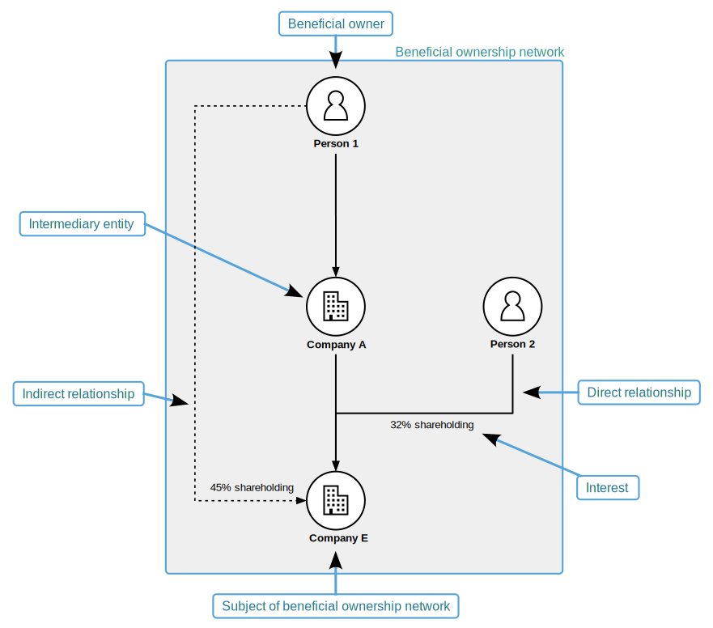
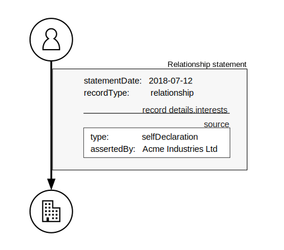
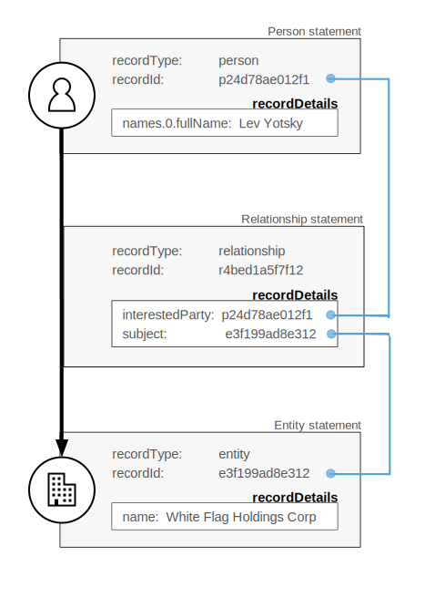
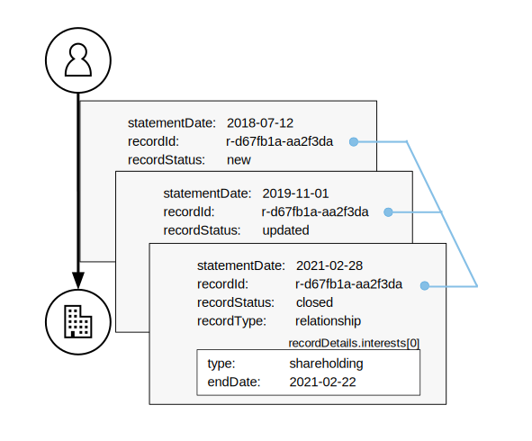

.. _key-concepts:

Key concepts
============

.. include:: warningbox.rst

Two things inform the Beneficial Ownership Data Standard (BODS) data model:

- what beneficial ownership information is
- how it is processed and used

Understanding these concepts and the data model will help you publish high-quality data.

Beneficial ownership concepts
-----------------------------

A natural **person** is a **beneficial owner** of an **entity** because of certain **interests**. These interests may be rooted in legal ownership, or come from controlling the entity, or using its assets. The **relationship** between the beneficial owner and the entity may be **direct**, **indirect** or both. Where it is indirect, **intermediary** entities, people and their relationships, are part of the **beneficial ownership network**.

People or entities are obliged in some jurisdictions to disclose their beneficial ownership. They declare this information to a designated agency. Each **declaration** is a set of **claims** about the entities, people and relationships within the **subject**’s beneficial ownership network. Information about those entities, people and relationships is captured by the agency in **records** which are updated as new claims are made.

sits on that solid line. Company E is also linked to Company A by a solid line. And Company A is linked to Person 1 by a solid line. Labelled as 'Indirect relationship' is a dotted line connecting Company E to Person 1. The text '45% shareholding' sits on that dotted line. Person 1 is labelled 'Beneficial owner'. Company A is labelled 'Intermediary entity'.
   :figwidth: 85%
   :align: center

BODS Statements represent claims
--------------------------------

The highest level object in a BODS dataset is a Statement. Each Statement represents a claim made by a source at a particular point in time. The claim can be about one of three elements of a beneficial ownership network:

- an entity (including companies, trusts and legal arrangements)
- a person (natural persons who own, control or benefit from entities)
- a relationship (consisting of interests between an entity and an interested party)

Representing beneficial ownership information in this way allows people to make sense of data received from multiple sources over extended periods of time. In particular, this model means that:

- statements about beneficial ownership can conflict when they come from different sources
- statements about beneficial ownership can overlap, referring to identical parties
- historical beneficial ownership snapshots (to answer questions of ‘who knew what, when?’) can be produced. This is known as `bi-temporal modelling <https://en.wikipedia.org/wiki/Bitemporal_Modeling>`_.

Statements should therefore be considered immutable – presenting details about an element of beneficial ownership as claimed at a particular point in time. 

To achieve this, each Statement produced by a data management system needs to include: 

- the details claimed about the entity, person or relationship, as stored by records in the system
- information about the source, date and context of the claim

After publication, publishers do not edit a Statement to indicate an information update: they publish a new Statement with the updated details of the record.

Beneficial ownership records
----------------------------

Data management systems need to internally maintain their own record with an appropriate ``recordId`` string for each person, entity and relationship whose details are disclosed. The ``recordId`` has two purposes:

- linking entities and persons via relationships
- publishing information updates

See :any:`record-identifiers` for full requirements.

Linking entities and persons via relationships
++++++++++++++++++++++++++++++++++++++++++++++

Stable ``recordId`` values in BODS Statements allow the structure of beneficial ownership networks to be derived from BODS datasets.

tement, recordType is 'person', the recordId is 'p24d78ae012f1', and the recordDetails show that the person's name is 'Lev Yotsky'. Within the relationship statement, the recordType is 'relationship' and the recordDetails show that the interestedParty is the record with recordId 'p24d78ae012f1' and the subject is the record with recordId 'e3f199ad8e312'. Within the entity statement, the recordType is 'entity', the recordId is 'e3f199ad8e312' and the recordDetails show that the entity is called 'White Flag Holdings Corp'. These elements represent Lev Yotsky's relationship with White Flag Holdings Corp.
   :figwidth: 50%
   :align: center

The Relationship statement holds ``recordId`` values for the interested party and the subject of a relationship. 

Publishing information updates
++++++++++++++++++++++++++++++

As real-world beneficial ownership changes, agents submit updated details about people, entities and relationships to the data management system. Then the system updates its records accordingly and publishes a new BODS Statement, containing the relevant ``recordId``, for each updated record.

People can then use ``recordId`` values to group Statements made over time to see what information was known when. 

3da' and the recordDetails show that these statements are about a shareholding interest. The earliest relationship statement has statementDate '2018-07-12' and recordStatus 'new'. The next has statementDate '2019-11-01' and recordStatus 'updated'. And the final relationship statement has statementDate '2021-02-28' and recordStatus 'closed'.
   :figwidth: 90%
   :align: center

Published BODS Statements build a write-only ledger, as new Statements are issued to amend or confirm details contained in older Statements.

See :ref:`information-updates` for full requirements.

Representing beneficial owners
------------------------------

In a BODS dataset, the fact that a natural person is a beneficial owner of an entity is represented by including this information in the Relationship statement linking the two.

It is possible to represent an entity's declaration that it has no beneficial owners (according to a jurisdiction's definition of a beneficial owner).

It is also possible to include in BODS datasets information about natural persons who are not beneficial owners. For example, where the managing officials of an entity are disclosed because nobody meets the jurisdiction's definition of a beneficial owner.

See :ref:`representing-bo` for full requirements.

The data model
--------------

Use the :doc:`Schema browser <schema-browser>` to explore the structure of the data model in full. Read the :any:`Schema reference <schema-reference>` for detailed definitions and requirements for each object and field.

The objects and fields of the data model allow you to represent a range of real-world situations. Explore related requirements in the :any:`modelling-requirements` section.
