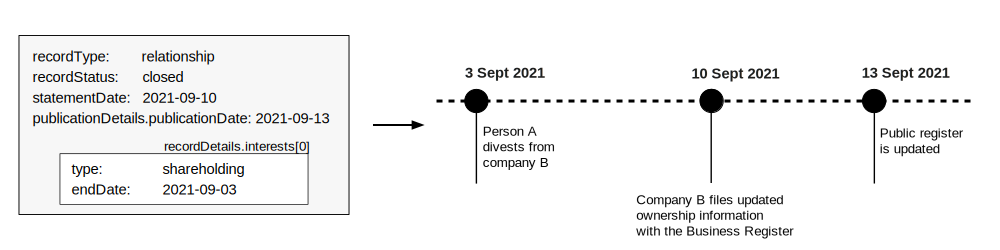
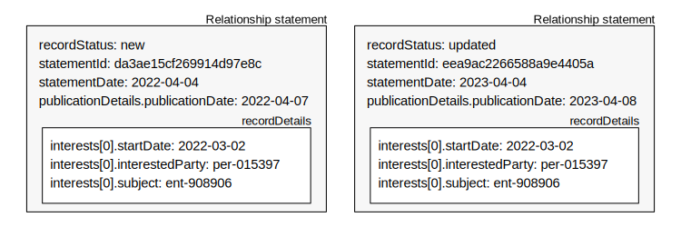

.. _guidance-dates:

Dates guidance 
==============

Key dates
---------

In BODS, dates represent real world events and information about how data has moved through a system. 

``statementDate`` is the date that the information about the entity, person or relationship is claimed to be true. This could be recorded automatically when someone submits an online declaration form or be the submission date listed on a physical form. For a service consolidating beneficial ownership data, it would be the date on which several sources of information were resolved to make a coherent claim about the state of an entity, person, or relationship.

``publicationDetails.publicationDate`` is the date this statement was published. For example, the date that the information was added to a public registry, or made available via an API. This can be the same as the ``statementDate`` value if data is published immediately after submission. In many cases there will be a delay between submission and publication.	

``interest.startDate`` is the date an interest started. For example, the date that shares were purchased or someone was appointed to the board of directors.

``interest.endDate`` is the date an interest ended. For example, the date that shares were divested of or that someone resigned from the board of directors.

``source.retrievedAt`` is only applicable where data is being republished. For example, some third parties might download data from government registries, transform it into BODS format and share it elsewhere. When this is done, they must provide information on when they downloaded the data from the government registry. 

Date rounding
-------------

For some fields, when exact dates are required but not known, rounded dates may be published. This is indicated in the schema description for those fields. 

Where a month is known but not the day, the first day of the month can be used. Where a year is known but not the month, the first day of the year can be used. 

Where rounded dates are used this should be communicated to users of the data, to prevent misunderstanding. Publishers SHOULD create accompanying guidance for data users.

For example:

* If an interest started in March 2022 but the day is not known the interest's ``startDate`` would be published as 2022-03-01
* If an interest started in 2022 but the month is not known the interest's ``startDate`` would be published as 2022-01-01 

Examples
--------

An interest ending
^^^^^^^^^^^^^^^^^^
This statement represents someone divesting from shares. We can use the statement to construct a timeline of events.

   
A confirmation process 
^^^^^^^^^^^^^^^^^^^^^^

Someone founds a company, registers it and discloses its beneficial owners. One year later nothing has changed. They file a confirmation declaration and a new Relationship statement is generated with an updated ``statementDate`` and ``publicationDate``. 

   
An error correction
^^^^^^^^^^^^^^^^^^^

Due to an error in the publication system, a relationship statement is published with an incorrect ``interests[0].startDate``. To correct this, a new statement is published replacing the incorrect one. 

The new statement:

* has the same ``statementDate``, because the date of the original information submission has not changed
* has a new ``publicationDate``
* has a corrected ``interest.startDate``
* has an :ref:`Annotation <schema-annotation>` explaining the correction

. 
   :figwidth: 75%
   :align: center

