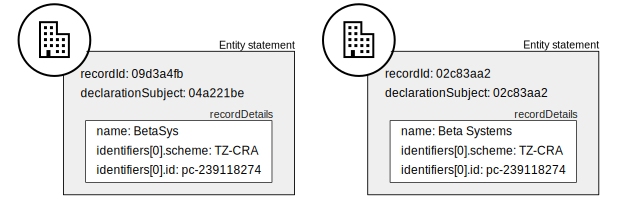

.. _record-identifiers:

Record identifiers
==================

To publish beneficial ownership data in BODS format, an information management system MUST maintain record identifiers for each element (person, entity and relationship) in each beneficial ownership network.

Record identifiers MUST be unique within the publisher's system and never reused to refer to a different element. 

There are situations where a publisher's system can allow information about the same person, entity or relationship to be collected in relation to the beneficial ownership networks of multiple different subjects. In these cases, information from different declaration subjects about the same person, entity or relationship can exist side-by-side and needs to be represented in published data. In these cases, each set of information MUST have its own record identifier. (See the example below.)

The value of an entity or person record identifier MAY be a function of: the identity of the entity or natural person, plus the identity of the subject of the beneficial ownership network in which the entity or person appears. See :ref:`guidance-identifiers` for guidance on representing the identity of entities and natural persons.  

The identity of a relationship is constituted by the identities of its subject and interested party. Therefore the value of a relationship record identifier MAY be a function of: the record identifiers of its subject and interested party, plus the identity of the subject of the beneficial ownership network in which the relationship appears.

Record identifiers are used for :ref:`representing-bo` and for :ref:`information-updates`.

Example scenario
----------------

Private companies in a jurisdiction are obliged to disclose to the Company Registration Authority: their legal owners and any beneficial owners with direct interests in the company. 

Alpha Corp. discloses one natural person as a beneficial owner (and legal owner) and it also discloses Beta Systems as a legal owner.

.. figure:: ../../_assets/AlphaCorp.svg
   :alt: Diagram of a beneficial ownership network. An entity node for the company Alpha Corp is connected via a solid line to a person node. Alpha Corp's node is also connected via a solid line to an entity node for the company Beta Systems. An entity statement block sits next to Alpha Corp's node. Within the entity statement, recordId is '04a221be'. An entity statement block sits next to Beta Systems's node. Within the entity statement, recordId is '09d3a4fb'. 
   :figwidth: 80%
   :align: center

Beta Systems declares that it has four direct beneficial owners. 

.. figure:: ../../_assets/BetaSys.svg
   :alt: Diagram of a beneficial ownership network. An entity node for the company Beta Sys is connected via a solid lines to four person nodes. An entity statement block sits next to the Beta Sys node. Within the entity statement, recordId is '02c83aa2'.
   :figwidth: 60%
   :align: center

Separate records are maintained by the Company Registration Authority for the information about Beta Systems disclosed by Alpha Corp. (record identifier 09d3a4fb) and the information which is self-disclosed by Beta Systems (record identifier 02c83aa2).

When the BODS data is published, there are statements about the two new Beta Systems records. 

Note that:

- the name of the company has not been consistently disclosed. 
- the two statements do refer to the same real world entity, as the ``scheme`` and ``id`` properties in both statements are the same.
- the two statements about the same real world entity relate to two different declaring subjects, as shown by the different ``declarationSubject`` values.
- the statement for ‘Beta Systems’ has been disclosed by Beta Systems itself, since the ``recordId`` value is also given as the ``declarationSubject``.

