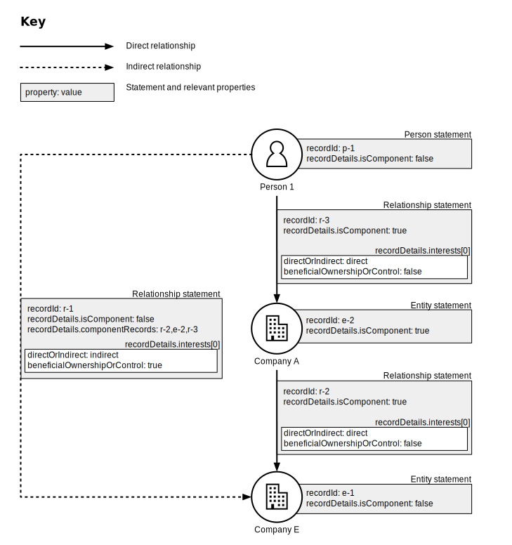

.. _representing-bo:

Representing beneficial owners
========================================

.. highlights::

    **Key requirements:** If a person is a beneficial owner of an entity - whether directly or indirectly - and the person or entity is required to declare this beneficial ownership, there MUST be a Relationship statement connecting the two which represents the beneficial ownership relationship.

    If an entity declares that it has no disclosable beneficial owners, its record MUST be the ``subject`` of a Relationship statement with ``recordDetails.interestedParty.reason`` 'noBeneficialOwners'.

Overview
------------------------

Beneficial owners can exercise their interests *directly* in an entity or *indirectly*, via intermediary entities (such as arrangements or other companies). It must be clear in a BODS dataset which people are declared as beneficial owners of which companies (and which entities are intermediaries). And it must be clear what overall interests beneficial owners have (regardless of whether they are direct or indirect).

In the above situation, Person 1 *indirectly* benefits from a 15% shareholding in Company E and Person 2 has a *direct* 32% shareholding in Company E. In a jurisdiction where people with a shareholding (direct or indirect) of over 10% in a company should be disclosed as beneficial owners, both Person 1 and Person 2’s interests would be declared. Additionally, the jurisdiction may require that details of Person 1’s indirect interest are disclosed. That is: that some details of the chain Company E - Company A - Person 1 are also disclosed. 

In BODS, the following properties are used to represent such information disclosure:

* ``beneficialOwnershipOrControl`` (See :ref:`schema-interest`)
* ``directOrIndirect`` (See :ref:`schema-interest`)
* ``componentRecords`` (See :ref:`schema-relationship-record`)
* ``isComponent`` (See :ref:`schema-entity-record`)

Requirements
------------------------

No beneficial ownership relationships
^^^^^^^^^^^^^^^^^^^^^^^^^^^^^^^^^^^^^

If an entity declares that it has no disclosable beneficial owners, its record MUST be the ``subject`` of a Relationship statement with ``recordDetails.interestedParty.reason`` 'noBeneficialOwners'.

If an entity is exempt from declaring its beneficial owners its record SHOULD be the ``subject`` of a Relationship statement with ``recordDetails.interestedParty.reason`` 'subjectExemptFromDisclosure'.

A beneficial ownership relationship
^^^^^^^^^^^^^^^^^^^^^^^^^^^^^^^^^^^^^

If a person is a beneficial owner of an entity, entity X, (whether directly or indirectly) and one of them is required to declare this beneficial ownership, there MUST be a *primary* relationship record connecting the two which represents the beneficial ownership relationship. Specifically, in the ``recordDetails`` for the relationship: 

- the entity’s ``recordId`` value MUST be the ``subject``
- the person’s ``recordId`` value MUST be the ``interestedParty``
- ``isComponent`` MUST be false
- the ``interests`` which make the person meet the criteria for being declared a beneficial owner MUST be included if known. They MUST have ``beneficialOwnershipOrControl`` set to 'true'. If an interest is known to be exercised indirectly, via intermediary entities then ``directOrIndirect`` MUST be ‘indirect’. If it is known to be exercised directly then ``directOrIndirect`` MUST be ‘direct’. Otherwise ``directOrIndirect`` MUST be ‘unknown’.

Intermediaries
^^^^^^^^^^^^^^

Where beneficial ownership is known to be exercised indirectly, via known intermediary elements, this SHOULD be represented in addition to the above. In particular:

- the chain of known intermediary elements SHOULD be represented by *secondary* records
- these secondary records SHOULD link the beneficial owner’s record to entity X’s record indirectly
- these secondary records SHOULD all have ``isComponent`` set to 'true'
- these secondary records SHOULD all have their ``recordId`` values listed in the ``componentRecords`` array of the ``recordDetails`` for the primary relationship.

When Statements about the primary relationship are published in a BODS file:

- Statements for all secondary records referenced from ``componentRecords`` MUST also be published in that file
- Statements for all secondary records must appear before the the first Statement for the primary relationship.

Example
--------

In the following example, Person 1 is a beneficial owner of Company E. They exercise that beneficial ownership via an intermediary company, Company A.

g Person 1 and Company A: recordId is 'ooc-3', recordDetails.isComponent is true, its interest has directOrIndirect as 'direct' and beneficialOwnershipOrControl as false. Relationship statement connecting Company A and Company E: recordId is 'ooc-2', recordDetails.isComponent is true, its interest has directOrIndirect as 'direct' and beneficialOwnershipOrControl as false. Relationship statement connecting Person 1 and Company E: recordId is 'ooc-1', recordDetails.isComponent is false, componentRecords are ooc-2 and e-2 and ooc-3; and its interests have directOrIndirect as 'indirect' and beneficialOwnershipOrControl as true.
   :figwidth: 90%
   :align: center

Statement order
^^^^^^^^^^^^^^^^
An example of valid statement order within a BODS dataset for the above would be: p-1, e-1, e-2, r-3, r-2, r-1.

