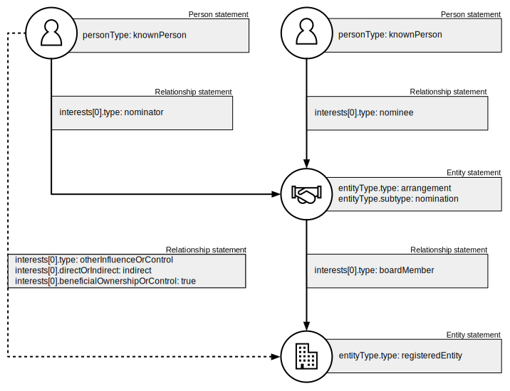
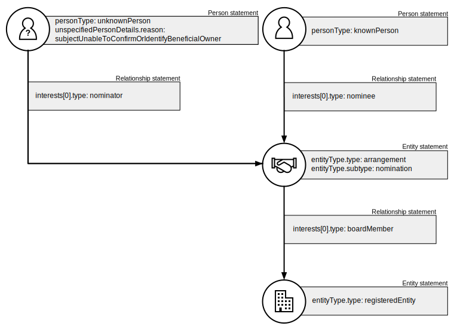
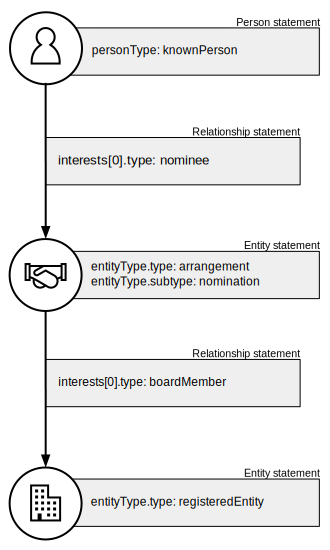

.. _representing-nominations:

Representing nominee arrangements
===============================================

Overview
--------
A ‘nominee arrangement’ is an agreement between parties where one (the nominator) instructs the other (the nominee) to act on their behalf in a specified capacity.

BODS can be used to represent the beneficial ownership of entities via nominee arrangements. Nominee arrangements are represented by an Entity Statement. 

When representing nominee arrangements:

* The ``entityType.type`` MUST be ``arrangement``
* ``entityType.subtype`` MUST be ``nomination``
* ``entityType.details`` MAY be used to give a local name or specify the type of nominee arrangement

Relationships between nominee arrangements and their parties MUST be represented using only these ``interest.type`` codes:

* ``nominator``
* ``nominee``

``interest.details`` MAY be used to give a local name (e.g. "agent" or "principal")

Examples
--------

Nominee directorship
^^^^^^^^^^^^^^^^^^^^
Two people enter into a nominee directorship arrangement for a company, and all details are known. Dotted lines represent the further Relationship statements needed to represent the indirect beneficial ownership of the parties.

See :ref:`representing-bo` for guidance on representing indirect beneficial ownership.

 statement by a relationship statement with interest type 'nominee'. A second entity statement with the type "Registered entity" is connected to the arrangement entity by a relationship statement with interest type 'board member'. There is also a relationship statement between the first person statement and the registered entity to represent that they are one of the ultimate beneficial owners of the registered entity. The interest type for this relationship statement is 'other influence or control'.
   :figwidth: 100%
   :align: center
   
Nominee shareholding
^^^^^^^^^^^^^^^^^^^^
Two people enter into a nominee shareholding arrangement for a company, and all details are known. 

 statement by a relationship statement with interest type 'nominee'. A second entity statement with the type "Registered entity" is connected to the arrangement entity by a relationship statement with interest type 'shareholding'.
   :figwidth: 100%
   :align: center
   
   
Entity as a nominee
^^^^^^^^^^^^^^^^^^^
A person enters into a nominee shareholding arrangement for a company, and the nominee is an entity.

 statement with entity type 'registered entity' by a relationship statement with interest type 'nominee'. A third entity statement with the type "Registered entity" is connected to the arrangement entity by a relationship statement with interest type 'shareholding'.
   :figwidth: 100%
   :align: center

Unknown nominator
^^^^^^^^^^^^^^^^^
Two people enter into a nominee directorship arrangement for a company and details for the nominator are required to be disclosed, but are unknown.

 unable to confirm or identify beneficial owner', by a relationship statement with interest type 'nominator'. The arrangement entity is also connected to a second person statement by a relationship statement with interest type 'nominee'. A second entity statement with the type "Registered entity" is connected to the arrangement entity by a relationship statement with interest type 'board member'.
   :figwidth: 100%
   :align: center

Nominator not required to disclose
^^^^^^^^^^^^^^^^^^^^^^^^^^^^^^^^^^
Two people enter into a nominee directorship arrangement for a company, and details for the nominator are not required to be disclosed. 

t with the type "Registered entity" is connected to the arrangement entity by a relationship statement with interest type 'board member'.
   :figwidth: 100%
   :align: center

