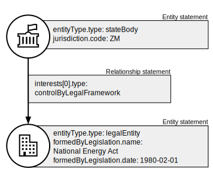

.. _representing-soes:

Representing state-owned enterprises
========================================

.. highlights::

    **Key requirement:** If an entity's status as a state-owned enterprise needs to be represented, then its Entity statement MUST be the subject of Relationship statements connecting it, either directly or indirectly, to an Entity statement with ``entityType.type`` of 'state' or 'stateBody'.

Overview
------------------------

The definition of 'state-owned enterprise' (SOE) can change according to jurisdiction or domain. The Beneficial Ownership Data Standard (BODS) does not therefore rely on, or support, any one definition. Instead, BODS enables the interests between a state (or state body) and an enterprise to be represented. This requires the state itself (or state body) to be represented by an Entity statement.

In particular, the following properties and values SHOULD be used to represent information about enterprises and their links to states:

* ``entityType.type`` SHOULD be set to 'state' or 'stateBody', and ``jurisdiction`` SHOULD be used to represent the particular state.
* ``entityType.subtype`` SHOULD be used to refine the category of a given state body (as a 'government department', 'state agency' or 'other').
* ``formedByStatute`` MAY be used to supply details of a law, where an entity has been formed as a result of specific legislation.

For more details about these properties see :ref:`schema-entity-record`.

Examples
--------

Ownership by state body
^^^^^^^^^^^^^^^^^^^^^^^

Ownership or control by a state body is known and a statement about these interests is possible.

.. figure:: ../../_assets/SOE-scenario1.svg
   :alt: Entity statement (with entityType type 'registeredEntity') is connected via a Relationship statement to an Entity statement (with entityType type 'stateBody' and jurisdiction 'gb').
   :figwidth: 50%
   :align: center

Ownership by regional government
^^^^^^^^^^^^^^^^^^^^^^^^^^^^^^^^

Ownership or control by a regional state government is known and a statement about these interests is possible.

.. figure:: ../../_assets/SOE-scenario2.svg
   :alt: Entity statement (with entityType type 'registeredEntity') is connected via a Relationship statement to an Entity statement (with entityType type 'state' and jurisdiction 'zm').
   :figwidth: 50%
   :align: center

SOE exempt from disclosure
^^^^^^^^^^^^^^^^^^^^^^^^^^

A registered entity declares that it is exempt from disclosing beneficial owners because it is an SOE.

.. figure:: ../../_assets/SOE-scenario3.svg
   :alt: Entity statement (with entityType type 'registeredEntity') is connected via a Relationship statement to an Entity statement (with entityType type 'state' and jurisdiction 'nl'). The Entity statement with entityType type 'registeredEntity' is also connected to a Relationship statement which has interestedParty.unspecified.reason set to 'noBeneficialOwners' and interestedParty.unspecified.description set to 'Exemption granted on the basis that the declaring entity is a state-owned enterprise'.
   :figwidth: 85%
   :align: center

Golden share provision
^^^^^^^^^^^^^^^^^^^^^^

Control through a golden share provision in company articles or shareholder agreement.

.. figure:: ../../_assets/SOE-scenario4.svg
   :alt: Entity statement (with entityType type 'registeredEntity') is connected via a Relationship statement to an Entity statement (with entityType type 'stateBody' and jurisdiction 'nl'). The Ownership-or-control statement has interests.0.type set to 'controlViaCompanyRulesOrArticles' and interests.0.details set to 'Veto rights over specified company decisions'.
   :figwidth: 50%
   :align: center

Managing official
^^^^^^^^^^^^^^^^^

An SOE controlled by a natural person.

.. figure:: ../../_assets/SOE-scenario5.svg
   :alt: Entity statement (with entityType type 'registeredEntity') is connected via a Relationship statement to an Entity statement (with entityType type 'state' and jurisdiction 'zm'). The Entity statement with entityType type 'registeredEntity' is also connected to a Relationship statement which has interests.0.type set to 'seniorManagingOfficial'. That last Relationship statement is connected to a Person statement with personType set to 'knownPerson'.
   :figwidth: 85%
   :align: center

Formed by statute
^^^^^^^^^^^^^^^^^

An SOE is formed by statute.

y' and jurisdiction 'zm'). The Relationship statement has interests.0.type set to 'controlByLegalFramework'.
   :figwidth: 50%
   :align: center

Government-linked investment entity
^^^^^^^^^^^^^^^^^^^^^^^^^^^^^^^^^^^^^^^^^^^^^^^^^^^^^^^^^^^^

A state's interests in an SOE are managed via a government-linked investment entity (GLIE).

.. figure:: ../../_assets/SOE-scenario7.svg
   :alt: Entity statement (with entityType type 'registeredEntity') is connected via a Relationship statement to another Entity statement with entityType type 'registeredEntity' and name 'A G.L.I.E'. That latter Entity Statement is connected via a Relationship statement to an Entity statement (with entityType type 'state' and jurisdiction 'gb').
   :figwidth: 50%
   :align: center

