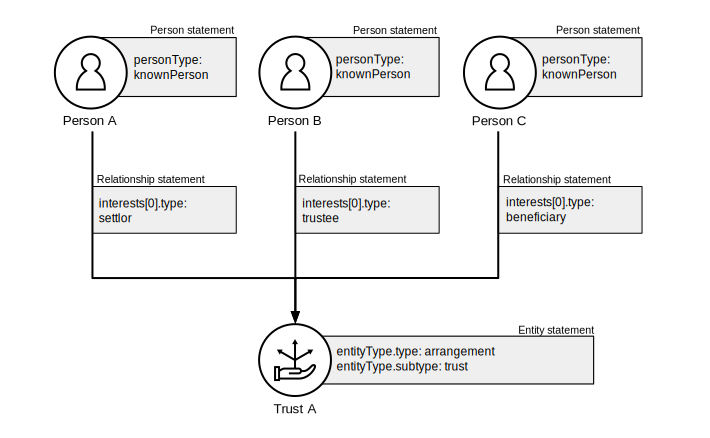
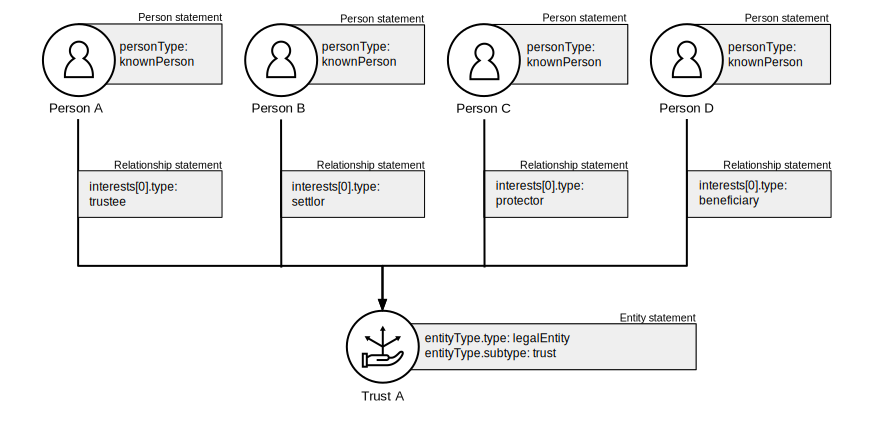
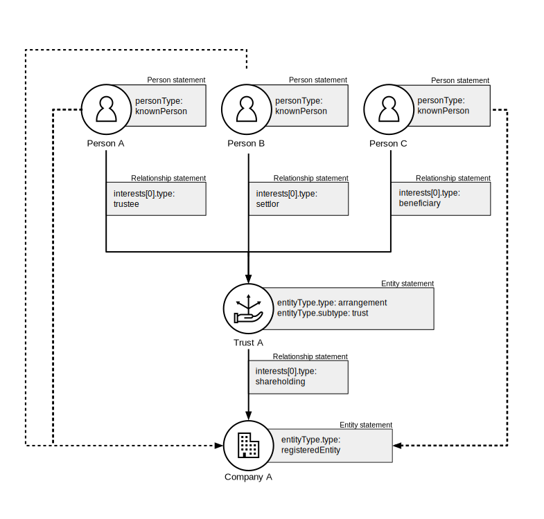
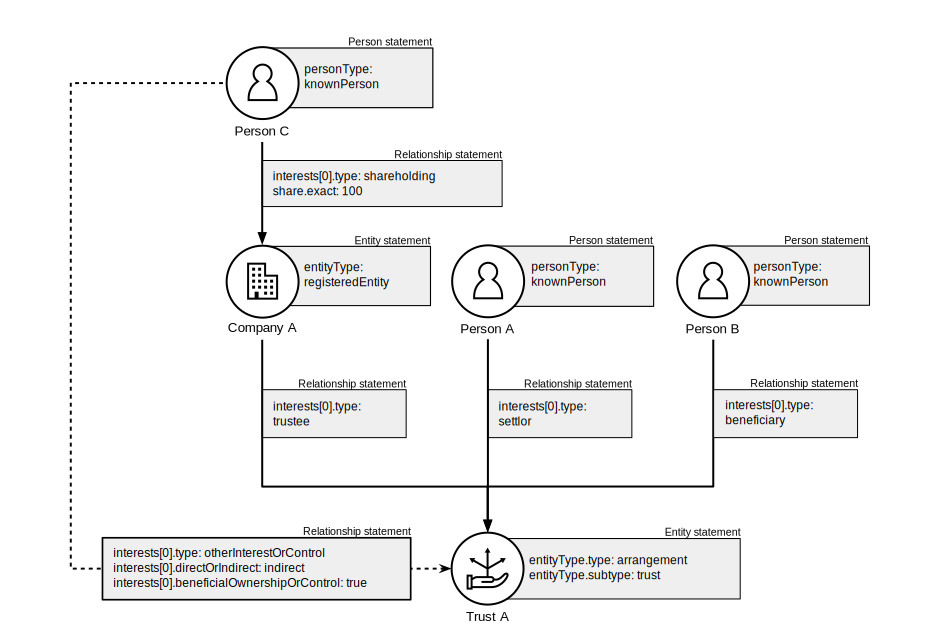

.. _representing-trusts:

Representing trusts
===============================================

Overview
--------
In this documentation, the term ‘trust’ is inclusive of trusts and trust-like arrangements (such as *fiducie*, *treuhand* and *waqf*). 

BODS can be used to represent the beneficial ownership of trusts and the beneficial ownership of entities via trusts. Trusts are represented by an Entity statement. 

When representing trusts:

* If the trust has legal personality ``entityType.type`` MUST be ``legalEntity``
* If the trust does not have legal personality ``entityType.type`` MUST be ``arrangement``
* ``entityType.subtype`` MUST be ``trust``
* ``entityType.details`` MAY be used to give a local name (e.g. "fiducie") or specify the type of trust (e.g. "inter-vivos trust")

Relationships between trusts and their parties MUST be represented using only these ``interest.type`` codes:

* ``settlor``
* ``beneficiary``
* ``trustee``
* ``protector``
* ``otherInfluenceOrControl``

``interest.details`` MAY be used to give a local name (e.g. "fiduciaire") or more information about the interest (e.g. "power to dissolve trust").

Example Scenarios 
----------------- 

Trust without legal personality 
^^^^^^^^^^^^^^^^^^^^^^^^^^^^^^^
A trust with a known beneficiary, known trustee and known settlor. The trust does not have a legal personality.

nterest type 'trustee', and person C by a relationship statement with interest type 'beneficiary'
   :figwidth: 80%
   :align: center
   
Trust with legal personality and protector
^^^^^^^^^^^^^^^^^^^^^^^^^^^^^^^^^^^^^^^^^^
A trust with a known beneficiary, known trustee, known settlor and known protector. The trust has a legal personality. 

interest type 'trustee', person C by a relationship statement with interest type 'protector', and person D by a relationship statement with interest type 'beneficiary.' 
   :figwidth: 100%
   :align: center
   
   
Trust with combined roles and anonymous beneficiary 
^^^^^^^^^^^^^^^^^^^^^^^^^^^^^^^^^^^^^^^^^^^^^^^^^^^
A trust where the settlor is also a trustee and the beneficiary is anonymous due to a disclosure exemption.

.. figure:: ../../_assets/trust-scenario3.svg
   :alt: Diagram show linked statements. Trust A is connected to person A by a relationship statement with interest types 'settlor' and 'trustee', person B by a relationship statement with interest type 'trustee', person C by a relationship statement with interest types 'beneficiary.' Person D has a person statement with person type 'anonymous person' and unspecified person details 'subject exempt from disclosure'
   :figwidth: 95%
   :align: center

Trust-like arrangement 
^^^^^^^^^^^^^^^^^^^^^^
A trust-like arrangement with local names for the entityType and interestTypes. 

.. figure:: ../../_assets/trust-scenario4.svg
   :alt: Diagram show linked statements. Entity statement labeled Trust A with entityType type 'arrangement', subtype 'trust', and details 'fiducie-sûreté.' Trust A is connected to person A by a relationship statement with interest type 'settlor' and interest details 'constituant', person B by a relationship statement with interest type 'trustee' and interest details 'fiduciaire', and person C by a relationship statement with interest type 'beneficiary' and interest details 'beneficiaire'
   :figwidth: 82%
   :align: center

Company shares held in trust
^^^^^^^^^^^^^^^^^^^^^^^^^^^^
A significant stake in a company is held in a trust. The parties to the trust are the beneficial owners of the company. Dotted lines represent the further Relationship Statements needed to represent the indirect beneficial ownership of the parties. 

See :ref:`representing-bo` for guidance on representing indirect beneficial ownership.

tween Company A and Person A, Person B and Person C to represent that they are the ultimate beneficial owners of Company A. 
   :figwidth: 90%
   :align: center
   
Company as a trustee
^^^^^^^^^^^^^^^^^^^^
A trust where the trustee is a company. In this jurisdiction, the owner of the company is deemed to be an indirect beneficial owner of the trust.

See :ref:`representing-bo` for guidance on representing indirect beneficial ownership.

een Person C and Trust to represent that they are one of the ultimate beneficial owners of Trust A. The interest type for this relationship statement is 'other influence or control.' There are also Person A and Person B the settlor and beneficiary of the trust. 
   :figwidth: 100%
   :align: center
   
   
Further Guidance 
----------------

The `Open Ownership website <https://www.openownership.org/en/topics/trusts-and-legal-arrangements/>`_ has more guidance and research on capturing beneficial ownership information about trusts and legal arrangements.

