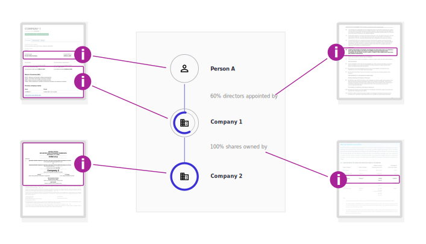
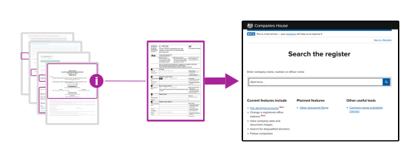

# What is beneficial ownership data?

<h2>From people's birth places to rules about shareholders' voting rights...</h2>

Data relating to beneficial ownership may include:

* Details of individuals
* Details of other legal entities
* A breakdown of share holdings 
* The voting rights attached to different share classes
* Details of intermediate entities in an ownership chain
* Rules of board membership 

And so on.

<h2>...data clarifying beneficial ownership is often scattered across documents...</h2>

The data is often included in companies’ annual reports, founding articles and filings to regulatory authorities. Bringing it all together can build the big picture about a company’s beneficial owners.



<h2>...presenting challenges when sharing or collating beneficial ownership information...</h2>

Accessing this data and understanding its relevance to beneficial ownership can be challenging:

* The data may only be a small part of a longer document.
* The same types of data will be represented differently by different publishers.
* Relevant data may appear across different documents.
* Legal terminology may differ across jurisdictions.

<h2>... which is becoming a frequent requirement for companies.</h2>

Increasingly, governments and regulatory authorities require beneficial ownership data to be disclosed and filed in official registers.



These challenges require us to structure and standardise beneficial ownership data, so that it has a reliable scope and predictable format.

```eval_rst 

.. highlights:: 
    
    Companies already hold data about beneficial ownership. Historically it has not been in a consistent format that facilitates reporting requirements. 

```


