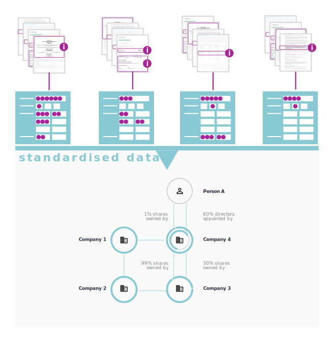
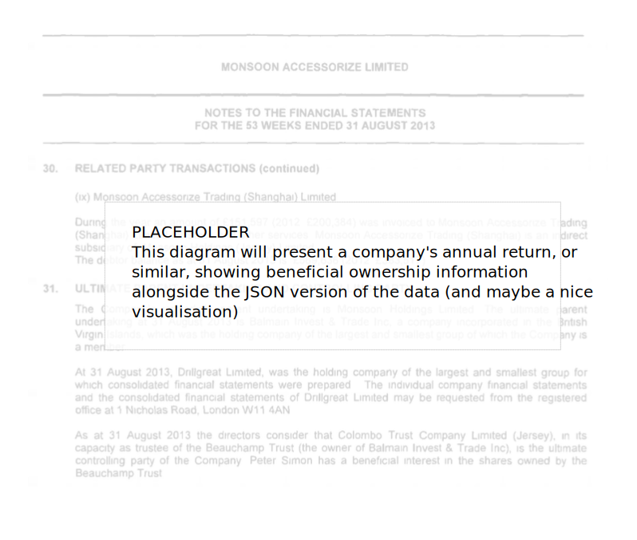

# What is the Beneficial Ownership Data Standard?

The value from beneficial ownership data comes when we can share it easily, knowing that it will be correctly understood. Data from different companies and different countries can then be combined, analysed and visualised.

## To gain insights about beneficial ownership...

Bringing together data from a variety of sources can give us insights into sprawling or complicated ownership and control structures. But processing, combining and analysing data that exists in a multitude of formats is extremely difficult and time-consuming.


Without a consistent approach to organizing the beneficial ownership data the bigger picture remains obscure. 

## ...data must be shared in standardised way...

The Beneficial Ownership Data Standard provides a structured data format plus guidance for collecting, sharing and using data on beneficial ownership:

* The [Data schema](schema.md) describes how and what data should be shared. It can also inform the design of data collection and management systems;

* The [User guides](index.md) give support for publishers and users of the data.




Using the Standard simplifies the sharing and use of beneficial ownership information.


## ...as structured data...

The data schema describes how data about the beneficial owners of a legal entity can be organized and stored. The schema is defined in a structured data format called JSON.



Using the popular JSON format facilitates computerised access and analysis of the data. The format is also human-readable.


```eval_rst 

.. highlights:: 
    
    The **Beneficial Ownership Data Standard** describes what data should be shared and how (as a JSON schema) and provides guidance on data publishing processes and data use.

``` 

