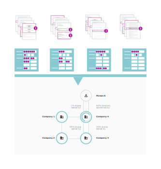

# What is the Beneficial Ownership Data Standard?

The value from beneficial ownership data comes when we can combine, analyse and visualise data from different companies and different countries. This can give us insights into wider ownership and control structures, but it requires data to be published in compatible and comparable formats.

(The above image is still work in progress)
